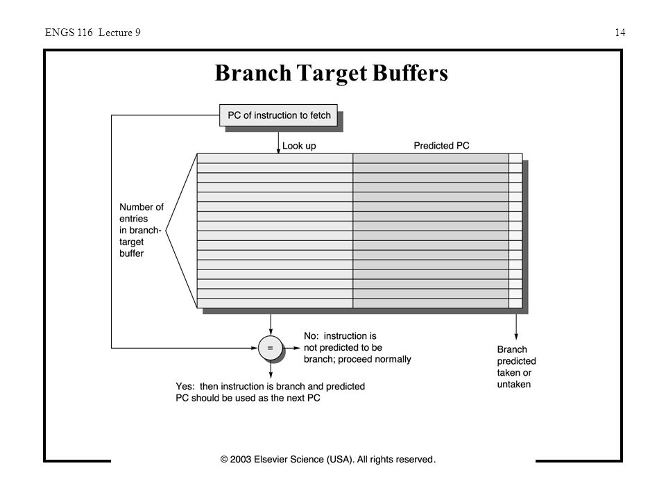
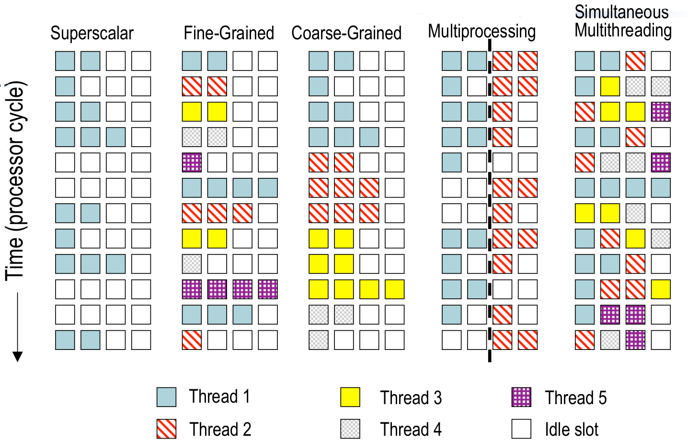

# ARQUITECTURA DE ORDENADORES

Este PDF incluye los contenidos de la asignatura Arquitectura de Computadores impartida en la Universidad Autónoma de Madrid durante el curso 2018-19.


#### Programa

- Abstracciones, Tecnología y Rendimiento de los Computadores.
- Procesadores Segmentados.
- Organización y Estructura de la Memoria: Cachés y Memoria Virtual.
- Técnicas avanzadas de paralelismo.
- Almacenamiento y otros aspectos de la E/S - No da tiempo a verlo


#### Bibliografía

Estructura y diseño de computadores: La interfaz Software/Hardware. D.A. Patterson y J.L. Hennessy

Computer Organization And Design: The hardware/Software Interface


___

## Rendimiento

- **Ley de Moore**: Afirma que cada 18 meses, el numero de transistores que caben en un procesador se duplica, aumentado la potencia. En algún momento dejará de cuplirse por los límites de los materiales en sí.

- **Sistemas embebidos o empotrados**: Un sistema de computación diseñado para hacer pocas cosas muy específicas. Por ejemplo, el bluetooth de un coche.

En primer lugar, hubo incremento en el número de bits, desde 8 hasta 32. El diseño de los ordenadores de 64 bits es de 32 bits, se han ampliado las instrucciones de los procesadores x86 para usar los 64 bits de memoria. 

Después de la estructura x86, pasamos a un procesador ***super scalar*** con una unidad independiente para enteros y para coma flotante, lo que permite ejecutar varias instrucciones a la vez.

Posteriormente aparece la ***ejecución especulativa***, y el ***ooo*** *(adelantamiento de datos)*, que ejecuta de forma desordenada las instrucciones sin cambiar la semántica.

Hacia el año 2004 aparece una tendencia muy importante, pasamos de los 25-100 MHz, hasta llegar a los 4GHz. Se intentó aumentar aún más este límite, pero parece no ser posible por el excesivo calentamiento, con lo que, en vez de aumentar la frecuencia de los procesadores, se pasó a aumentar el número de nucleos. Así, los sistemas operativos se tuverieron que adaptar a este tipo de procesador para aprovechar el rendimiento.


#### Entendiendo el rendimiento

Para conseguir aprovechar el rendimiento de un procesador, tenemos que tener en cuenta:

- Algoritmos de ejecucion.
- Lenguajes de programación, compiladores y arquitectura.
- Procesador en sí mismo y su sistema de memoria.
- Entrada salida.

#### Procesador

Todo procesador tiene:

- Camino de datos: Realiza operaciones sobre los datos. Banco de registros, ALU, lineas de conexión, etc.
- Unidad de control: Controla la operación de la ALU, si se leen o escriben datos en la memoria, el PC, etc.
- Memoria caché: para el acceso inmediato a los datos.

Un set de instrucciones que es lo que en el fondo define el rendimiento del procesador, pues depende del número de ciclos de reloj del procesador. Define la interfaz entre el software y el hardware. Tenemos que distinguir entre dos filosofías distintas en el set de instrucciones (*ISA*). El primero de estos es ***RISC***, un set de intrucciones muy simples y reducido, donde todas tienen la misma longitud. La segunda filosofía es ***CISC***, con un set mucho más grande de intrucciones simples y complejas que pueden tener distinta longitud.

##### ¿Como comparamos el rendimiento de un procesador?

Definimos rendimiento como $rendimiento = \frac{1}{TiempoEjecucion}$

En primer lugar, podemos calcular el tiempo de ejecución de un programa (CPU time) usando $T_{ejec}=NI*CPI*T{c}$. Con $NI$ numero de instrucciones, $CPI$ el numero medio de ciclos por instruccion, y $T_{c}$ el tiempo de ciclo.

Teniendo instrucciones de distinta longitud etc, podemos poner $T_{ejec}=T{c}*\sum{NI_{i}*CPI_{i}}$, con $NI_{i}$ el número de intrucciones del tipo i, y $CPI_{i}$ el número medio de ciclos de dicha instrucción.

Así, el compilador por ejemplo puede afectar al numero de instrucciones, y el diseño del procesador al número de ciclos. 

A la hora de comparar el tiempo de ejecución, ponemos en el numerador el tiempo mayor, $\frac{Ra}{Rb} = \frac{Tb}{Ta}=\frac{15}{10}=1,5 $ . Así, podemos decir que el rendimiento de a es 1.5 veces el de b, o un 50% mejor. Tenemos que tener en cuenta sin embargo el tiempo en el que el sistema operativo cambia de proceso, de contexto, etc, con lo que no es justo comprar procesadores con distintos sistemas operativos, recursos externos, etc.

Es importante la ***Ley de AMDAHL*** para calcular la mejora conseguida. Llamando $Ag$ a la aceleración global, $F_{m}$ a la fraccion mejorada, que va de cero a 1 (Si antes duraba $T0+T1$ y hemos disminuido mucho $T1$, $F_{m} = \frac{t1}{t0+t1}, A_{m} = \frac{t1}{t1'} = \frac{f1'}{f1}$, si usamos la frecuencia), y $A_{m}$ a la aceleración mejorada, el factor de mejora:

$$Ag = \frac{1}{1-F{m} + \frac{F_{m}}{A_{m}}}=\frac{T_{ejec antes}}{T_{ejec despues}}$$

Si tenemos varias mejoras, la fómula sería:

$$Ag = \frac{1}{1-\sum_{i=0}^{n}{F{m_i}} + \sum_{i=0}^{n}{\frac{F_{m_i}}{A_{m_i}}}}$$

Una vez tenemos calculada la $Ag$, para calcular el tiempo de ejecución tras la mejora, sumamos el tiempo de ejecución de la parte no afectada, más el de la parte afectada partida de $Am$, la aceleracion mejorada. Por tanto, lo más eficiente es conseguir hacer los casos más comunes muy rápidos.

#### Métricas del rendimiento.

Podemos usar otros métodos para medir el rendimiento, como métricas, que permiten medir y comparar el rendimiento de distintos sistemas.

- **MIPS**: Millones de instrucciones por segundo $$\frac{NI}{T_{ejec}*10^6}$$ = $\frac{FrecuenciaReloj}{CPI*10^6}$

- **MFLOPs**: Millones de operaciones en coma flotante por segundo. Muy usado por su simplicidad y efectividad $$\frac{NI}{T_{ejec}*10^6}$$

- **SPEC CPU Benchmark**: Elegimos una serie de programas (12-15) que están relacionados con lo que va a hacer el ordenador. Tomamos una máquina de referencia y medimos en ella el tiempo de cada programa. En la máquina nueva, el test, volvemos a calcular los tiempos de los programas, y calculamos todos los ratios de ejecución, que es el tiempo en la máquina de refrencia entre el tiempo en el test, para luego hallar la media geométrica.

  Media = $\sqrt{\prod{\frac{T_{i}^{ref}}{T_{i}^{test}}}}$

- **Potencia consumida**: $CargaCapacitiva * Voltaje ^2 * Frecuencia$.

#### Ley de Gustafson

Una alternativa a la **Ley de AMDAHL** que permite tener en cuenta el paralelismo de los procesadores actuales.

#### Evolución de los procesadores

Para reducir la potencia consumida por los procesadores, se decidió aumentar el número de núcleos y disminuir la frecuencia y el voltaje en un 15%.

Desde 2002 hasta 2005, apareció el multi-threading, que permite que un núcleo se comporte como dos, y se sigue utilizando en intel. Aparecieron entonces los procesadores multicore, que pueden seguir manteniendo el multi-threading.

Para aprovechar los procesadores multicore, aparece la ejecución fuera de orden (ooo).

Para medir la potencia que consume un procesador, podemos usar **SPEC Power Benchmark**: Medimos las operaciones Java que hace por segundo, y calculamos a potencia media que usa el procesador. Podemos ver que no aumenta de forma lineal, por lo que lo óptimo es tener un 80% del rendimiento para aprovechar al máximo el procesador.

## El procesador segmentado

Hay que elegir un set de instrucciones, con lo que usamos RISC, y más concretamente un procesador MIPS. Para ello, tenemos que decidir el datapath y el control.

Decidimos un formato de instrucciones de 32 bits, usando los 6 primeros bits para la operación.

Definimos también la arquitectura general del procesador, Harvard en este caso, donde tenemos una memoria de datos y una de instrucciones, con registros de 32 bits. Además, usamos una ALU de 32 bits, que es justamente lo que define que el procesador tiene 32 bits.


En negro, tenemos el datapath, mientras que en azul tenemos la línea de control.

La ALU de la parte superior del diagrama permite hacer saltos en el código.

Distinguimos entre tres tipos de instrucciones. Todas comienzan con 6 bits que indican el tipo de operación, **OPCode**, y dos campos de 5 bits cada uno que indican los registros Rs y Rt:

- **Tipo R**: OPCode=000000. Otro registro más, de destino, Rd, otros 5 bits de shamt, y 6 que indican la función que es.

  Por ejemplo *Add rd, rs, rt* que realiza la operación *rd <= rs + rt*.

- **Load/Store**: *ld rt, rs, 1000*. Equivale a *rt <= MEM[rs + 1000]*. 

  *sw rt, 100(rs)* equivale a *MEM[1000+rs] <= rt*.

- **Branch**: *BEQ R1, R2, 100*. Si R1 y R2 son iguales, saltamos 100 instrucciones, con lo el PC aumenta 4*100. Con el camino de datos usado, solo podemos hacer saltos relativos al PC, y máximo salto puede ser $2^{16}$. No podemos saltar a valores absolutos.

- **Jump**: Al contrario que el resto de las instrucciones, solo tiene el OPCode y 26 bits de direccion, que se multiplican por 4, y se le añaden los cuatro primeros bits del PC siguiente. Nos permite movernos $2^{26}$ instrucciones.


Para mejorar el rendimiento, que ahora está limitado por la duración de la instrucción load, la mas larga, podríamos pasar a una arquitectura multiciclo, que nos permitiría incrementar la velocidad del procesador. Sin embargo, complicaría mucho el diseño, con lo que en vez de usar esto, vamos a usar **segmentación (pipelining)**.

Al usar la segmentación, la aceleración máxima que podemos conseguir, es el número de etapas, que tienen que diferenciar tareas independientes. En nuestro caso, vamos a hacer 5 etapas:

- IF: Se lee el registro de la memoria de instrucciones y se actualiza el PC a PC+4. Solo se usa la memoria de instrucciones.
- ID: Decodificamos la instruccion y leemos los operandos. Solo se usa el banco de registros para leer los operandos.
- EX: Se ejecuta la operación en la ALU, y se comprueba la condición del salto. Usamos la ALU, el add auxiliar, y el PC para sumar el dato inmediato.
- MEM: Accedemos a la memoria de datos, y actualizamos el PC si tiene que haber un salto. Usamos la memoria de datos y el PC.
- WB: Escribimos en el banco de registros, que es el único recurso que se usa.

Para poder distinguir entre estas etapas, tenemos que añadir un registro en cada paso de una etapa a otra, para guardar el valor entre dos etapas.


Lo ideal para que la aceleración sea la mayor posible es que todos los segmentos necesiten el mismo tiempo, sin embargo, es imposible dividirlo así (o muchisimo mas complicado).

En el procesador segmentado, incrementamos la velocidad de la salida de instrucciones, pero no la latencia, pues cada instrucción tarda aún cinco ciclos de reloj.

#### Riesgos estructurales y de saltos

Incluimos una unidad de detección de riesgos en nuestro procesador, que hasta ahora se tenían que resolver mediante software, esperando. Hacemos entonces una unidad de adelantamiento de datos, en vez de la de espera (forwarding vs stalling). Estos riesgos pueden ser de tres tipos:

**Riesgo estructural**: Se produce por el acceso simultáneo a un recurso desde dos instrucciones distintas que corren a la vez. Por ejemplo, el acceso a memorias cuando hay un bus único y dos instrucciones intentan acceder simultáneamente. La solución es duplicar recursos, como separar memoria de datos e instrucciones.

**Riesgo de datos**: Cuando hay una lectura de un valor que escribe la instrucción anterior (RAW, Read After Write). Por ejemplo, ejecutamos un *add* guardando el resultado en *R1*, y en la siguiente instrucción usas *R1*, que aún no estaría actualizado. Para solucionarlo, el compilador añade dos instrucciones vacías (si se puede leer y escribir en el banco de registros en el mismo ciclo, si no, 3), que obliga a la segunda instrucción a esperar (si el banco de registros escribe en la primera mitad del ciclo y lee en la segunda). Otra opción es usa *adelantamiento*, pues la primera instrucción calcula el resultado en el primer ciclo, y la siguiente no lo necesita hasta el segundo, con lo que podemos usar hardware, con un multiplexor que vaya a la ALU, para pasar directamente el resultado, evitando desperdiciar ciclos. En el *lw* sin embargo, el dato se genera en el 4º ciclo, por lo hay que adelantar y añadir una espera. 

Tambien hay WAR (una instrucción modifica un destino antes de que otra lo haya leido) y WAW (se modifica el orden normal de escritura), pero solo tienen sentido en procesadores que adelanten trabajo, con ejecución fuera de orden.

**Riesgo de control**: Se deben a cambios en la secuencia de ejecución de instrucciones. En los branch y los saltos, para evitar problemas, necesitamos calcular la condición de salto y actualizar el PC en la parte ID. Tenemos que añadir a dicha etapa una nueva ALU que permita comprobar la condición del salto restando el contenido de los registros. Movemos también el desplazador y la ALU que calcula el PC del branch. O bien, cancelar las instrucciones siguientes al branch si el salto es efectivo, convirtiéndolas en NOPs.


### Unidad de detección de riesgos y adelantamentos.

Queremos poder llevar el resultado de una operación de la ALU, que se hace en el tercer ciclo, al tercer ciclo de las dos instrucciones siguientes, para evitar errores al intentar leer dicho resultado de memoria. 

##### Detección de adelantamientos

Para detectar el adelantamiento, tenemos que ver pasar Rs, Rt y Rd al registro intermedio ID/EX, y Rd al EX/MEM y a MEM/WB también. Realmente pasamos el registro destino, no Rd, que para LW por ejemplo es distinto, pues sería Rt. Así, podemos ver si el valor que vamos a usar se ha escrito en los dos ciclos anteriores, para ello: 

- Nos aseguramos de que la instrucción de la que adelantamos escriba en registro (tenga RegWrite a 1 en el registro en el que se esta ejecutando), y de que el registro Rd no sea el 0.

- Tenemos que hacer adelantamiento cuando uno de los registros Rs o Rt guardados en ID/EX, coinciden con el registro Rd guardado en EX/MEM o en MEM/WB. 
- Si coincide, hacemos un adelantamiento cogiendo dicho dato de EX/MEM o MEM/WB, el que haya coincidido.
- Si adelantamos desde MEM/WB, tenemos que tener en cuenta que no se cumpan las condiciones de adelantar desde EX/MEM

Las condiciones serían

- if (EX/MEM.RegWrite and (EX/MEM.RegisterRd ≠ 0) and (EX/MEM.RegisterRd = ID/EX.RegisterRs))
  ​	ForwardA = 10

* if (EX/MEM.RegWrite and (EX/MEM.RegisterRd ≠ 0) and (EX/MEM.RegisterRd = ID/EX.RegisterRt))
  ​        ForwardB = 10

* if (MEM/WB.RegWrite and (MEM/WB.RegisterRd ≠ 0) and not (EX/MEM.RegWrite and (EX/MEM.RegisterRd ≠ 0) and (EX/MEM.RegisterRd = ID/EX.RegisterRs))
  and (MEM/WB.RegisterRd = ID/EX.RegisterRs)) 

  ​        ForwardA = 01

* if (MEM/WB.RegWrite and (MEM/WB.RegisterRd ≠ 0) and not (EX/MEM.RegWrite and (EX/MEM.RegisterRd ≠ 0) and (EX/MEM.RegisterRd = ID/EX.RegisterRt))
  and (MEM/WB.RegisterRd = ID/EX.RegisterRt)) 

  ​       ForwardB = 01

##### Detección de riesgos

Tenemos que ser capaces, en la fase IF/ID, de detectar si la instrucción anterior era un load que iba a cargar uno de los registros que usamos. En ese caso, detenemos la actualización del PC durante un ciclo, impedimos que se modifique el registro IF/ID, y convertimos las señales de control en ID/EX a 0, para tener un NOP en vez de la instruccion que tocaría. La condición sería:

​	ID/EX.MemRead and ((ID/EX.RegisterRt = IF/ID.RegisterRs) or (ID/EX.RegisterRt = IF/ID.RegisterRt))


Aún así, estas paradas reducen el rendimiento del sistema, pero el compilador puede reorganizar el código para evitar algunos de estos riesgos y paradas.


### Riesgos de branch

Al ejecutar un branch, como tomamos el salto en MEM, se ejecutan las tres instrucciones siguientes. Para evitar esto, podemos poner sus valores de control a cero al detectar un branch.

Lo más efectivo, es adelantar el salto del branch a la etapa ID, moviendo allí el sumatorio del PC y el desplazador del dato inmediato, y creando un comparador del contenido de rs y rt. Así, solo se ejecutaría una instrucción posterior, que la podemos congelar.

Podemos intentar predecir el resultado del branch para esa siguiente instrucción, de forma que solo la convertimos en NOP si la predicción resulta ser incorrecta. Hay distintas formas de predicción:

- Ejecutar las instrucciones siguientes hasta saber si se salta o no, y cancelarlas si es necesario.

- Suponer que si los saltos son a código anterior se salta, y si son hacia delante no.

- Usar predicción dinámica, con uno o dos bits, empleando una máquina de estados para decidir el salto a partir de los anteriores.

- Branch Target Buffer (**BTB**): tenemos una tabla indexada mediante el PC, con columnas la dirección del salto, y los bits de la predicción.

  

En este caso, al haber adelantado el branch, si el salto de un branch depende de instrucciones de tipo R que están justo antes del branch, no se puede solucionar con adelantamiento, hay que añadir un ciclo de penalización, o dos si depende de un lw justo anterior.


## Memoria

Usamos el principio de localidad, de forma que al capturar un dato de memoria, cogemos también los de alrededor y los almacenamos en una memoria intermedia entre procesador y RAM, esta es la **memoria caché**, que es de tipo SRAM en vez de DRAM, por tanto, es mucho más rápida y cara.

En cada memoria tenemos un tamaño de bloque. Para transferir datos entre la RAM y la caché, transferimos bloques enteros, no solo datos específcos. Así, cuando el procesador solicita un dato, se lo solicita a la caché, si esta lo tiene en uno de sus bloques (se denomina un hit de dato), lo pasa al procesador, si no lo tiene (miss de dato), lo solicita al siguiente nivel, la RAM en este caso, y acaba pasándolo al procesador.

Podemos determinal el tiempo de acceso como $t_{ss} = t_{c} + (1-H)t_{b}$ con $t_{c}$ el tiempo de acceso a la memoria caché,  $t_{b}$ el tiempo de acceso a la memoria secundaria, y $H$ el porcentaje de hits.


Tenemos que conseguir encontrar un dato dentro de la caché, detectar si el dato es o no correcto, y leerlo de la memoria secundaria si es necesario. Para esto podemos usar:

- **Correspondencia directa**: cada posición de la memoria secundaria va a una posición en la caché, siempre a la misma, usando el módulo del número de bloques de la chaché. Es muy facil de aplicar en hardware, pues basta con coger un número x de bits de la dirección en la memoria secundaria, sin embargo, tenemos que ver si el dato es o no correcto.

  Tenemos un primer bit de validez, que indica si hay o no dato. Para ver si el dato corresponde al buscado, guardamos el TAG de la dirección, esto es, el resto de bits de la dirección de la posición en la memoria secundaria, quitando los que hemos usado para identificar la celda en la caché. 

  En una dirección por tanto, tenemos, de derecha a izquierda, un offset que llamamos byte en bloque, el numero de bits necesarios para redireccionar los bytes de un bloque, el índice que nos indica el bloque de la caché, y el resto sería el tag.

  

- **Completamente asociativa**: cualquier bloque puede ir en cualquier posición. La dirección tendría únicamente el TAG para buscar y el byte en bloque. El principal problema es que la búsqueda del dato es complicada, necesitamos un comparador por cada una de las posiciones y que funcionen simultáneamente, con lo que el coste de la caché sube.

- **Asociativa de n-vías**: Tenemos n cachés de correspondencia directa en paralelo. Un campo índice indica la posición en cada memoria, y usamos n comparadores simultáneos para ver en cuál de las memorias está el TAG buscado, de forma que podemos guardar n datos que vayan a la misma posición, solucionando el problema de la correspondencia directa. 

  Usamos n comparadores simultáneos, con lo que es más barata que la completamente asociativa.

  

Así, al incrementar la asociatividad de la memoria disminuye la tasa de fallos, pero aumenta el precio. Estos fallos pueden venir del arranque del programa, que obliga a cargar bloques enteros, por la falta de capacidad, o por colisiones en las posiciones, cosa que no ocurriría en una completamente asociativa. Por ejemplo, en una memoria de correspondencia directa de tamaño N, el numero de fallos será aproximadamente igual al de una memoria asociativa de dos vías y tamaño N/2.

Podemos intentar cambiar el diseño para mejorar la tasa de fallos, pero todo tiene sus inconvenientes:

| Cambio                       | Efectos en la tasa de fallos         | Problemas en el rendimiento                                  |
| ---------------------------- | ------------------------------------ | ------------------------------------------------------------ |
| Aumentar el tamaño           | Disminuyen los fallos por capacidad  | Puede aumentar el tiempo de acceso                           |
| Aumentar la asociatividad    | Disminuyen los fallos por colisión   | Puede aumentar el tiempo de acceso                           |
| Aumentar el tamaño de bloque | Disminuyen los fallos en el arranque | Puede aumentar la tasa de fallos por tener datos innecesarios cargados |


### Estructura de memoria

Independientemente del tipo de memoria caché elegida, necesitamos operar con las memorias superiores para coger datos en caso de fallo, elegir qué bloque reemplazar, etc.

Una vez la memoria caché detecta un fallo, tiene que ser capaz de detener la CPU, leer el bloque del siguiente nivel de memoria (más lento), y reiniciar la instrucción que ha causado el fallo.

Al leer el bloque del siguiente nivel de memoria, la caché (excepto si es de correspondencia directa), tiene que elegir qué bloque reemplazar, para lo que hay distintos algoritmos.

- Elegimos una entrada con el bit de validez a cero. Si no hay, aplicamos uno de los dos siguientes.
- **LRU** (Least-recently used): Elegimos el que lleva más tiempo sin usarse, esto es, el que tiene los bits de LRU con el número más alto, pues se ponen a 0 cuando se utilizan y se les suma uno cada ciclo que no se utiliza. Es efectivo para dos y cuatro vías. A partir de ahí se complica.
- Elegimos una entrada aleatoria. Cuando la asociatividad es alta, el rendimiento es similar a LRU.

#### Políticas de esritura

Cuando modificamos un dato que se encuentra en la memoria caché, podemos usar dos políticas distintas:

- **Escritura directa** (Write-through): Actualizamos los nieves superior e inferior, lo que simplifica el reemplazo y evita inconsistencias, pero puede requerir de un buffer de escritura, pues escribir continuamente raleentizaría bastante la CPU, por lo que escribimos únicamente cuando el buffer esté lleno.
- **Pos escritura** (Write-back): Actualizamos únicamente la caché, y llevamos un registro de los bloques que han sido modificados, mediante un bit de *dirty*. De esta forma, escribimos el bloque modificado en memoria cuando vaya a ser reemplazado. Podemos usar un buffer de escritura para permitir leer el bloque sustituto sin tener que esperar a que el sustituido se escriba.

Si el bloque que queremos modificar no está en caché, en políticas write-through podemos coger el bloque o escribir la modificación posteriormente en memoria directamente, en write-back normalmente cogemos el bloque y lo modificamos en la caché.

### Medir el rendimiento de la caché

El número de ciclos que se paraliza la CPU por el acceso a memoria sería: $\frac{instrucciones}{programa}*\frac{fallos}{instruccion}*PenalizacionMiss$

$CPIreal = CPIbase + CPIMissInstrucciones + CPIMissDatos$ con $CPIbase$ el numero de ciclos cuando hay un Hit, y los otros calculados con la fórmula anterior.

El tiempo medio de acceso sería el tiempo de Hit más la tasa de fallos por la penalización de fallos.

#### Memorias caché multinivel

Podemos añadir una segunda caché de nivel dos (L2) entre la principal y la memoria, más grande que de primer nivel pero más lenta, e incluso una caché de tercer nivel (L3).

En estos casos donde tenemos varios niveles de caché, la penalización de fallo de la de primer nivel es lo que tarda la de segundo nivel, y la penalización de la caché L2 es el tiempo que tarda en leer L3, o la memoria si no hay nivel tres. Tendríamos que sumar además todo lo que tardan las otras cachés.

Normalmente, en estas memorias de segundo nivel, se intenta que la tasa de fallos sea baja, y por tanto los bloques son mayores que los de primer nivel.

### Memoria Virtual

Usamos la memoria principal como una memoria caché del disco duro, y necesitamos hardware (MMU) y software (SO) para conseguir que esto funcione correctamente.

Gracias a la memoria virtual, cada programa percibe una serie de direcciones virtuales únicas, como si toda la memoria fuese suya, y estas direcciones se traducen a direcciones físicas reales usando la CPU y el SO. En esta memoria virtual, denominamos páginas a los bloques, y fallo de página a los Miss.

En el caso de que haya un fallo de página, es necesario leerla del disco, que es un proceso muy lento y costoso gestionado por el SO. Para intentar minimizar estos fallos de página, la memoria es completamente asociativa, y usamos algoritmos de reemplazo inteligentes.

#### Traducción de direcciones

- Si tenemos páginas de tamaño fijo, la dirección virtual nos da el número de página virtual y el offset dentro de dicha página, de forma que solo tenemos que traducir el número de página virtual al número de página física, y usar el offset de la dirección virtual.

- Segmentos de tamaño variable: la dirección incluye el segmento y el offset, y cada entrada en la tabla de traducciones tiene la posición de inicio del segmento, el tamaño, los bits de control y los del LRU.

  Una vez buscamos el segmento en la tabla de segmentos, tenemos que comprobar que el offset sea menor que el tamaño de segmento (que puede variar), y sumar el offset a la dirección que aparece en la tabla, no concatenarlo como en las páginas.

- Segmentos con páginas de tamaño fijo: no se estudiará en este curso.

#### Tablas de páginas

Para traducir una dirección virtual a una física, usamos una **tabla de páginas** indexada por el número de página virtual. Esta tabla contiene un bit de validez que indica si está presente en la memoria (y por tanto la tabla guarda su dirección en memoria junto con otros bits de modificado, referenciado, etc), o si no está presente y por tanto guarda su posición en el disco.

Sin embargo, esta tabla puede ser demasiado grande y costosa, con lo que aparecen entonces las **tablas de página multinivel**, donde no todas las subtablas residen en memoria. La dirección virtual contiene la posición que ocupa el marco a buscar en cada una de las tablas, cada subtabla te indica la siguiente, hasta que la última contiene el marco de página en el que se encuentra la buscada.

Para mejorar el rendimiento de este sistema, añadimos un **TLB** (Translation Look-aside Buffer) en la CPU, que tiene de 16 a 512 **PTE**s (Page Translation Entry). De esta forma, comprobamos en primer lugar si el TLB tiene la página que estamos buscando, y en caso de no tenerla, la cargamos desde memoria y reiniciamos la instrucción. Este manejador del fallo en el TLB se puede hacer mediante hardware o mediante software. Si aún así la página no está en memoria (aunque su traducción sí que lo esté ya), se producirá un fallo de página y se leerá de disco, actualizando la tabla de páginas, y se reiniciará la instrucción.


Para reducir el número de fallos usamos el algoritmo LRU con un bit de referencia que se pone a cero periodocamente. Usamos la estrategia write-back para saber qué bloques están modificados y escribirlos todos de golpe.

Además de estos bits de referencia, modificado, etc, estas tablas incluyen bits de protección usados por el SO como bits de lectura, escritura, etc.

##### Caché y TLB

Si la memoria caché usa direcciones físicas para el TAG, es necesario traducir la dirección antes de poder buscar los datos en la caché, con lo que podemos usar la memoria virtual en la caché, añadiendo a la dirección virtual el número de proceso, pues distintos programas pueden tener la misma dirección virtual.

Si usamos una caché con las direcciones reales, podemos aumentar el rendimiento si el índice y el byte en bloque de la memoria caché están en el offset de la dirección virtual, pues de esta forma solapamos parte de la búsqueda en el TLB con la búsqueda en la caché, y solo tenemos que esperar para comparar el tag de las distintas vías.

#### Memoria compartida

Diferentes procesos pueden compartir parte de su memoria virtual usando el SO como intermediario para evitar errores. Para esto, tenemos instrucciones privilegiadas, el modo kernel, etc.


## Técnicas avanzadas de paralelismo

### Paralelismo a nivel de instrucción

Una de las mejores formas de mejorar el rendimiento de un procesador es aumentar el paralelismo a nivel de instrucción, el numero de instrucciones que se ejecutan de forma simultánea, que se implementa mediante:

- Una segmentación más profunda, diviendo el procesador en más etapas independientes, de forma que el ciclo de reloj es más corto y la aceleración conseguida mayor.

- Emisión múltiple, que permite ejecutar las instrucciones en distintas *unidades funcionales* independientes (grado del procesador super escalar), por ejemplo, una linea para operaciones de enteros, otra para memoria, etc. Se puede implementar de dos formas:

  - Estática: se resuelven problemas mediante el compilador, que agrupa las instrucciones en paquetes que se puedan ejecutar de forma simultánea. Es el caso de los **VLIW** (*Very Long Instruction Word*).

    El principal problema es que, cuando el compilador no puede organizar varias instrucciones, rellena con NOP, con lo que en el caso de VLIW, donde el 'paquete' de instrucciones se interpreta como una única instrucción muy larga, esto genera un desperdicio enorme de memoria. Sin embargo, tiene como ventaja unas unidades de control mucho más simples, y una frecuencia de CPU mayor.

    Para que realmente sea eficiente, es necesario mejorar bastante los compiladores (especialmente en predicción de saltos etc), pues son quien determinan la efectividad de procesador.

  - Dinámica: para evitar problemas RAW, WAR y WAW, es el hardware en tiempo real el que selecciona las instrucciones y controla los riesgos, aunque puede estar ayudado por el compilador. Es el caso de los **Superscalar**.

    

    Para que esto sea factible, añadimos *estaciones de reserva* antes de cada unidad funcional, que permiten solucionar los riesgos RAW y llevar una ejecución fuera de orden, usando finalmente un buffer que almacena los resultados antes de escribirlos. Así, emitimos y finalizamos en orden, pero la ejecución es fuera de orden.


Aún así, estos dos sistemas tienen limitaciones, pues en muchas ocasiones no se pueden ejecutar varias instrucciones a la vez por dependencias etc, con lo que la ejecución especulativa, explicada más adelante, puede ayudar.

### Multithreading

Replicamos algunos recursos como los registros, el PC, etc, con el fin de poder tener múltiples hilos de ejecución en paralelo y que se puedan cambiar rápidamente. El algoritmo de cambio de thread puede ser de *grano fino*, donde cada ciclo cambiamos de thread a uno que no esté bloqueado, o de *grano grueso*, donde cambiamos únicamente en esperas largas como fallos de caché. Actualmente se dan 'slots' de tiempo a cada uno de los hilos, y hay que conseguir que el cambio de hilo sea lo más rápido posible.

En el caso de los procesadores con emisión múltiple dinámica, podemos usar **multithreading simultáneo** donde las instrucciones de los distintos threads se ejecutan de forma simultánea cuando las unidades están disponibles, y entre threads las dependencias se solucionan usando *renombramiento de registros*.




### Multicore

Tenemos múltiples núcleos cada uno de ellos con multithreading y distinta frecuencia, que compaten una misma caché y bus de memoria, con lo que podemos ejecutar múltiples procesos, y varios hilos de cada proceso.

### OpenMP

Compilador que permite aprovechar el paralelismo de un procesador, especialmente cuando los cores tienen memoria compartida. Permite usar paralelismo de grano fino (en bucles y sentencias) y grueso (en programas y subrutinas).

Se indica mediante ```#pragma omp parallel {...}``` la región paralelizada, de forma que al entrar se crean los threads y se unen automáticamente al acabar dicha región. Estos threads se comunican usando variables compartidas, lo que produce:

- Fallos de caché, dependiendo de si varios hilos tienen la misma caché (lo que producirá más fallos), o si tienen cachés independientes, que ralentizará el compartir los datos.

- **False sharing:** Se da cuando las variables de threads distintos se almacenan en el mismo bloque de caché, lo que provoca que cada vez que un thread quiera acceder haya que escribir el bloque en memoria. La solución puede ser aumentar el tamaño de las variables para asegurarnos de que se almacenan en distintos bloques.

- **Data race:** Surge al ejecutar en paralelo código pensado para ejecutarse en secuencial. Se sobreesribe el mismo valor en distintos hilos, con lo que el resultado es erróneo.

A la hora de paralelizar una región, tenemos que tener en cuenta el tiempo que tardan en crearse los distintos hilos, el control de la caché y la sincronización. Además, es importante tener en cuenta factores como el acceso a una matriz, que es más rápido por filas que por columnas, o el usar variables locales en cada proceso, y que estas variables se junten luego usando un *reduction* por ejemplo.

PAGINA 22 EN ADELANTE


### MIPS con emisión doble estática

Se emiten dos instucciones de forma simultánea, una de ALU/branch y otra de load/store.

Permitimos leer más registros simultáneamente dentro del banco de registros, y añadimos una nueva ALU que nos permita calcular las direcciones de memoria mientras se calcula el dato en la ALU original. Impide que se puedan adelantar resultados de la ALU a las instrucciones load/store. Realmente la mejora de rendimiento es muy pequeña. Una solución sería que el compilador agrupase las instrucciones para que puedan ejecutarse dos de forma simultánea.

En un bucle for por ejemplo, podemos ejecutar varias vueltas del bucle de forma simultánea (es decir, *desdoblar el bucle*) usando renombramiento de registros, con lo que el rendimiento aumenta bastante.

### Planificación dinámica

A la hora de evitar riesgos en estos casos, si emitimos y finalizamos en orden las instrucciones evitamos los riesgos WAR y WAW. Si solo la emisión es ordenada, sí que puede haber riesgos RAW y WAW, pero no WAR, y si hacemos ambas cosas fuera de orden tenemos que preocuparnos por los tres tipos de riesgos. Para este último caso, tenemos una ventana de instrucciones donde esperan, después de ser decodificadas, a tener los recursos necesarios disponibles o que se solucionen las dependencias, llamada *reservation station*, junto con un buffer de reordenamiento para asegurar que los resultados se escriban correctamente.

#### Renombramiento de registros (RRF)

Permite cambiar los registros usados por un grupo de operaciones, de forma que se puedan ejecutar simultáneamente con otro grupo que empleaba esos mismos registros de forma independiente. Por ejemplo, hacemos un load en R1  y una serie de operaciones con dicho valor, y después otro load en R1. Podemos cambiar el segundo load y las instrucciones que empleen dicho valor por otro registro, permitiendo así que se puedan paralelizar ambos grupos de instrucciones. Se usa en las estaciones de reserva y en el buffer de reordenación.

Este método evita riesgos WAR y WAW, pues el compilador o el hardware en sí pueden cambiar el destino de algunas operaciones a registros alternativos reservados para este fin. 

Usamos una serie de registros de renombramiento, y una tabla donde se vinculan estos registros con los originales, caracterizando cada registro con una etiqueta, junto con una unidad de control que se encarga de modificar dicha tabla.

Así, al ejecutar una instrucción añadimos una entrada al banco de renombramiento de registros con el registro destino de dicha operación.

#### Estaciones de reserva

Cada unidad funcional tiene un buffer con múltiples entradas, todas ellas de cinco campos: un identificador, y dos para cada operando. 

En los campos de cada operando se guarda una etiqueta, y el valor de dicho operando. En el caso de haber un riesgo en un operando, la etiqueta identifica el registro del buffer de renombramiento que nos dará el valor. De esta forma, cuando una unidad funcional termina, compara su etiqueta con el campo etiqueta de los operandos de todas las estaciones de reserva, y si coinciden, guarda el valor en el segundo campo del operando.

#### Buffer de reordenación (ROB)

Almacena en orden las instrucciones emitidas para asegurar que terminen en orden. Cuando una instrucción finaliza la etapa de ejecución, se actualiza su estado en el buffer, y una vez se finaliza dicha instrucción, sale del buffer.

#### Funcionamiento

En primer lugar, al leer y decodificar la instrucción, reservamos una entrada en el buffer de reordenación y añadimos una entrada con su registro destino al buffer de renombramiento (excepto si la instrucción no escribe en ningún registro). Avanzamos la instrucción a la estación de reserva apropiada.

Cargamos los datos de los operandos, o las etiquetas del buffer de renombramiento, a la estación de reserva, y esperamos a tener el valor de todos los datos. Entonces emitimos la instrucción a la unidad funcional, actualizando el estado en el buffer de reordenación, y liberando la entrada de la estación de reserva. Una vez acabada la etapa de ejecución, difundimos el resultado a las estaciones de reserva que esperen nuestra etiqueta.

Cuando esté listo para finalizar, actualizamos la entrada del banco de registros usando la tabla de renombramiento de registros, y en caso de ser un store, se envia al buffer de store. Liberamos la entrada del buffer de reordenación y de la tabla de renombramiento.

### Ejecución especulativa

Como tenemos unidades funcionales de sobra que no están en uso, especulamos para ejecutar instrucciones que pueden ser adelantadas, aunque finalmente no se ejecuten. Por ejemplo, realizar los saltos, accesos a memoria antes de tiempo, como especular sobre la siguiente dirección que se va a usar etc. Esta especulación sirve para arquitecturas de emisión estática y dinámica.

El compilador puede reordenar algunas instrucciones, como por ejemplo, adelantar loads que van depués de un branch, o incluir instrucciones de load especulativas, e instrucciones **fix-up** que permiten desechar todos los cambios hechos por dichas instrucciones especulativas.

Para evitar riesgos de ejecución, simplemente vamos almacenando los resultados en un buffer, de forma que podemos descartarlos si es necesario, y mantenemos el orden.

Para la ejecución especulativa de un load, podemos intentar predecir la dirección, el valor cargado, cargar el valor antes de escribir el buffer de stores, etc.

#### Predicción en saltos

Predecimos el salto y ejecutamos las instrucciones correspondientes al resultado de dicho salto, pero las finalizamos o descartamos únicamente cuando conozcamos el resultado del salto.

En el caso de usar un predictor correlacionado, tenemos un registro llamado **BHR** que tiene $m$ bits y guarda el resultado de los $m$ últimos saltos, y $2^m$ tablas **BHT** con entradas indexadas por los últimos bits de la dirección de la intrucción branch (quitando los dos menos significativos, que serán siempre cero), y que contienen $n$ columnas de branch anteriores. Cuando especulamos, usamos el BHR para elegir una de las tablas BHT, elegimos la fila según los últimos bits de la instrucción, y decidimos.

> Por ejemplo. Supongamos un BEQ en la direción $0xA018$ y un predictor(2, 1). Tendríamos un BHR con los resultados de los dos últimos branches, que nos señala una de las $2^2$ tablas BHT de por ejemplo, 8 entradas. Para predecir el salto, vamos al BHT señalado por el BHR, y dada la dirección del BEQ, cogemos los 3 últimos bits (necesitamos 3 bits para señalar 8 entradas), sin contar los dos menos significativos que son siempre cero, esto es: $0x18=00011000$, tomamos $110$. Cogemos por tanto la entrada 6 del BHT, y esta es nuestra predicción de saltos.

Si la predicción no es creible, ejecutamos ambos caminos, aunque esto tenga inconvenientes como el necesitar mas PCs, y que los dos caminos compitan por los recursos.

**Ejecución basada en registros de predicados** Cada instrucción de una rama esta asociada a un registro de predicados, de forma que cuando uno de los predicados es cierto se finalizan las instrucciones adecuadas y el resto se convierten en NOP. Esto permite eliminar algunos tipos de instrucciones branch, pero tiene la desventaja de que es necesario cambiar la instrucción branch para que, en consecuencia con el resultado, se le de valores a los predicados.

La complejidad de estos sistemas de emisión dinámicos, especulativos etc, requiere una potencia adicional,  con lo que lo más óptimo es tener varios núcleos más simples.

### Intel IA-64

Usa el formato VLIB con *bundles* de 128 bits compuestos por tres instrucciones de 41 bits y un template de 5 bits que indica en qué unidad funcional se ejecuta cada instrucción y la dependencia entre este bundle y el siguiente. Podemos formar grupos de instrucciones, especificándolos en el código fuente, incluso dividiendo un budle en dos grupos distintos.

El compilador utiliza renombramiento de registros, desenrollamiento de bucles y actualización de referencias.

### Multiproceso

Para optimizar el uso del procesador, ejecutamos varios procesos simultáneamente, cambiando entre unos y otros cuando se producen fallos de caché, bloqueos etc.

Para cambiar el proceso o thread que está ejecutando el procesador tenemos que hacer un **cambio de contexto**. El **contexto** incluye los recursos del procesador asociados a un proceso, como pueden ser los registros usados, el PC, la tabla de páginas, etc. Y hay que tomar decisiones sobre elementos como la caché y las entradas del TLB y BTB.

Cuando se da una interrupción el sistema operativo guarda el contexto del hilo/proceso detenido, carga todo el contexto del hilo/proceso a reanudar, excepto el PC, y finalmente carga dicho PC que reinicia la ejecución. Sin embargo, este cambio de contexto por software tarda como mínimo 64 ciclos (hay que cargar 32 registros), con lo que podemos mejorar el rendimiento si replicamos en hardware los registros guardados en el contexto, y se permite que varios contextos compartan caché, TLB y BTB añadiendo un id de proceso.

Para hacerlo aún más rápido, en el caso de paradas por riesgos tipo RAW por ejemplo, usamos el multithreading, que permite que estas paradas no causen pérdidas de rendimiento.


