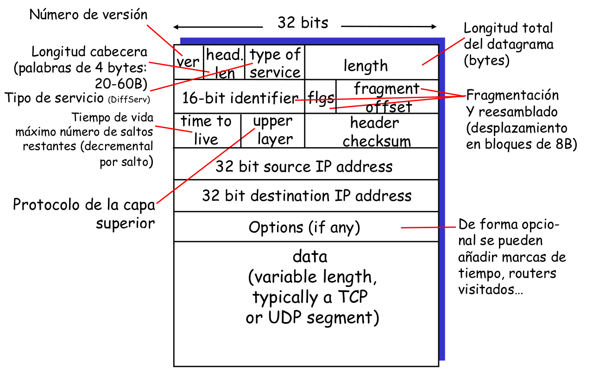
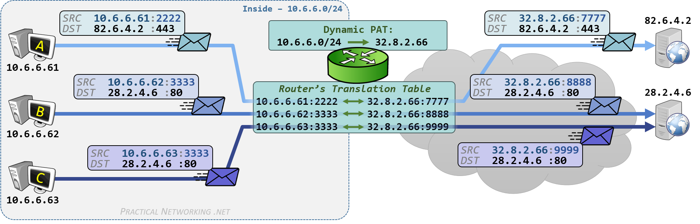
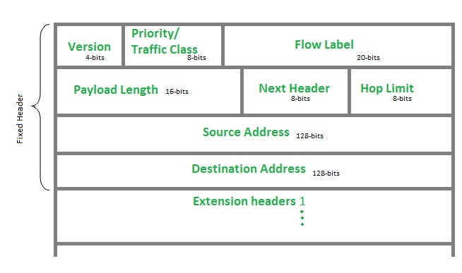
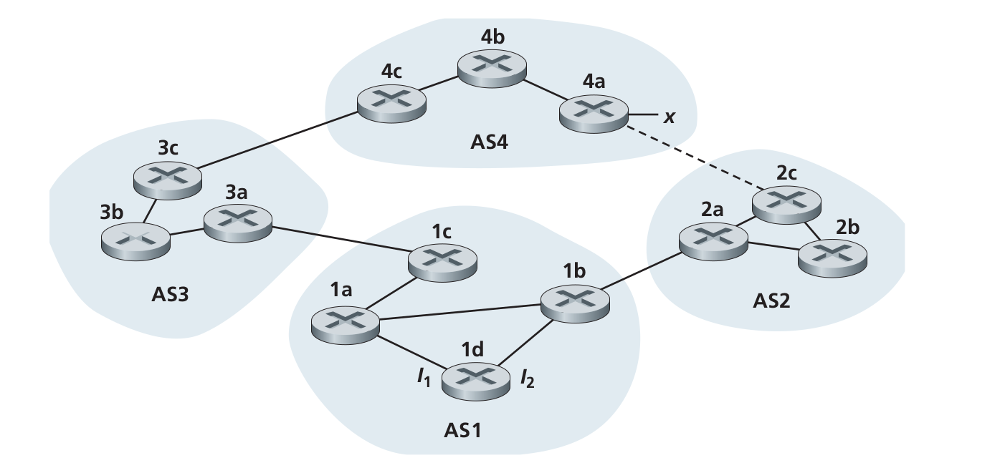
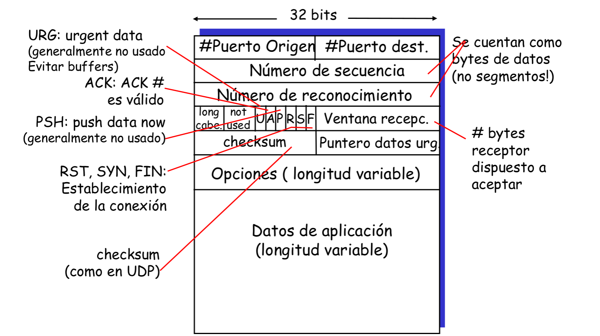
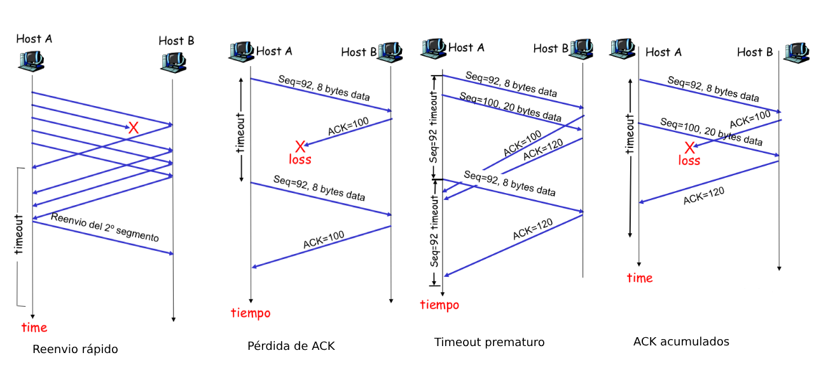
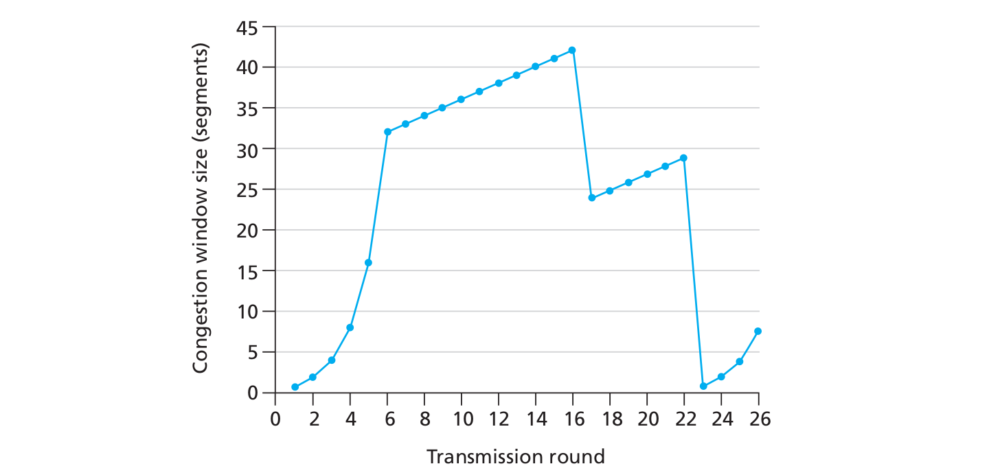

# REDES DE COMUNICACIÓN I

Este PDF incluye todo lo estudiando en la asignatura Redes de Comunicaciones 1 en la Universidad Autónoma de Madrid durante el curso 2018-19. Es un resumen tanto de los videos de Javier Aracil de la primera parte del curso, como de las más de 200 diapositivas escritas en comic sans sacadas del *Kurose*. Aparecen además algunas soluciones a ejercicios de los principales tipos para asentar conceptos.

##### Primera parte de la asignatura

##### Semana 1

### INTERNET

Un conjunto de operadoras que interconectan a sus clientes, y se interconectan entre sí de tres maneras:

- **De una forma directa**: Usando un cable de fibra entre un nodo de cada operadora (peering agreement).

  Obligaría a una operadora a tener peering agreements con el resto del universo.

- Mediante un **punto neutro** de interconexión: Un nodo donde van todas las operadoras a intercambiar datos. El más grande de España está en Arturo Soria.

- A través de lo que llamamos una **operadora de operadoras** (las normales, como Vodafone, Yoigo, etc, son operadoras de clientes). Un ejemplo es Telxius. Las operadoras de clientes se conectan a las operadoras de operadoras con uno de los métodos anteriores.

Por norma general , las operadoras se organizan en tres niveles:
- **Troncal** Interconectan dos o mas routers del anillo metropolitano, corresponden a un país. Están fuertemente mallados. Distintos metros se conectan tambien en forma de anillo y unos con otros tambien. 
- **Metro**: Interconectan los puntos de acceso, los routers, dentro de una ciudad. Usamos la redundancia para evitar fallos. Se conectan entre si como un anillo doble, con redundancia, para evitar fallos si se rompen, pues permite reconfigurar las conexiones.
- **Acceso**: Antenas 4G, routers etc. Se conectan a varios metro simultáneamente para evitar problemas.

Desde abajo hasta arriba hay mas redundancia.

___

##### Semana 2

### ANCHO DE BANDA, RETARDO, JITTER Y PERDIDAS

- **Ancho de banda** Tasa/velocidad a la que introducimos los bits dentro de la red. Dado un ancho de banda C en bits por segundo (bps), y un archivo de B bits, el tiempo que tarda el archivo en entrar en la red, llamado tiempo de transmisión, sería $T_{x}=\frac{B}{C}$, que no es el tiempo que tarda en llegar a otro sitio.

- **Retardo** Puede ser de *propagación*, producido por recorrer una distancia D a una velocidad de propagación $V_{p}$ m/s (suele ser de unoa $5us/km$), o de *congestión*, que se produce por el paso de la información entre distintos routers que pueden o no estar congestionados.

  El retardo total sería la suma del retardo de propagación y el de congestión.

  El tiempo de propagación de la red, sería entonces $T_{p}=distancia/V_{p}$. 

- **Jitter** Variabilidad del retardo, que depende de la congestión de los routers por ejemplo. Se puede medir como el máximo retardo menos el mínimo, o como la desviación estándar del retardo.

- **Pérdidas** El número de paquetes perdidos entre el número de paquetes recibidos.

#### Servicios de internet

##### Servicios de Streaming

Que pueden ser emsiones en directo, o en diferido, a una cierta tasa (ej, 1Mb/s). 

Es necesario un ancho de banda suficiente que permita mantener una tasa contínua. El dispositivo que reproduce el contenido tiene un buffer que permite ir almacenándolo, y que ha de estar siempre lleno. En el momento en el que el buffer se vacía, el contenido se detiene.

Lo ideal es, además, que el retardo con el que se transmiten los paquetes, sea constante, para que el buffer de reproducción esté lleno, y se reciban los paquetes en orden. Es necesario que el jitter sea moderado.

Para medir el retardo en los servicios de Streaming, tenemos que diferenciar a su vez entre servicios interactivos (como una videollamada, etc), que son los servicios en los que el retardo tiene que ser menor, que estar limitado.

Tenemos que tener en cuenta también la pérdida de datos, de paquetes, que se puede ignorar directamente, produciendo un parpadeo o *glitch*, o retransmitir de nuevo el paquete perdido, para lo que es necesario que el buffer esté siempre bastante lleno.

Por tanto, la red ha de tener bastante capacidad, lo que es caro.

##### Servicios de no Streaming

Páginas web normales, fotos etc. Requieren una descarga de contenidos, pero no es necesario un ancho de banda muy grande, o retardos muy pequeños, el tiempo no es tan importante.

___

##### Semana 3

### Arquitectura en capas

La inernet conecta un servidor, con una fibra por ejemplo, a un router al que se conectan los dispositivos, y para su correcto funcionamiento, tiene que encargarse de:

- Transmitir el paquete por el cable, fibra, o radio, mediante una señal electromagnética.
-  Mandar el paquete a un salto, con lo que el terminal que recibe los datos, necesita conectarse a la wifi por ejemplo. El paquete va dando saltos entre routers al transmitirse por internet. El primer salto es en el que pasa del dispositivo al router.
- Enrutar el paquete en varios saltos, es decir, tenemos que decidir el camino que seguirá el paquete dentro de todos los enlaces de la red.
- Recuperarse frente a pérdidas en los extremos. Así, cuando algo falla, se retransmite dicho fallo y se soluciona.

Para organizar todas estas funcionalidades, usamos capas con funcionalidades diferenciadas. Cada capa usa los servicios de la que tiene por debajo, y presta servicio a la que tiene por arriba.

En dispositivos como pueden ser teléfonos móviles, tenemos en primer lugar un **nivel físico**, que se encarga de producir la señal electromagnética. Este nivel físico es usado por el **nivel de enlace o link** en inglés, que se encarga de seleccionar el punto de acceso y mandar el mensaje en un salto al router al que esté conectado. El **nivel de red o network**, permite entonces enviar dicho paquete a una dirección mediante distintos saltos. Finalmente tenemos el **nivel de transporte**, que se encarga del control extremo a extremo, tiene una llamada *write*, que permite enviar la información extremo a extremo a su destino, y que controla la perdida de paquetes.

En un router físico sin embargo, como queremos que sea lo más simple posible, tenemos simplemente un nivel de red al que se conectan un nivel de enlace y uno físico correspondiente a la wifi, y un nivel de enlace y otro físico correspondientes a la fibra.

Por tanto, lo más importante es estandarizar la interfaz entre los distintos niveles, de forma que las llamadas sean iguales independientemente del dispositivo, pero la implementación pueda variar. Así, podemos añadir posteriormente mejoras como el 4G o 5G. Esto se denomina **arquitectura abierta**.

### Protocolos

**Protocolo** Conjunto de mensajes que, enviados en orden entre dos agentes, permiten ejecutar una determinada acción. Un ejemplo de protocolo seria la asociación a un punto de acceso, donde los agentes serían el dispositivo y el punto de acceso.

En el caso de una conexión a través de internet, los agentes serían los niveles de transporte del equipo receptor y el servidor. Para que esto sea posible, hay que asignar a cada paquete un número de secuencia, que permita al otro nodo afirmar que ha recibido el paquete. Este número de secuencia se añade como una cabecera del paquete. Así, cada nivel del dispositivo, añade un dato a la cabecera, y lee unicamente el dato que le corresponde. Por tanto, si cambiamos el nivel de enlace, pasando de wifi a 3G por ejemplo, hay que cambiar dicha cabecera, pero no el resto.

Cuando el nivel de red recibe el paquete, lo recibe sin la cabecera del nivel de enlace, se dice que se ha desencapsulado el paquete de nivel de red del de nivel de enlace.

Así, favorecemos la independencia de los niveles y la arquitectura abierta.

___

##### Semana 4

### Direcciones IP y MAC

Las **direcciones IP**, también llamadas direcciones de nivel de red, se dividen en las privadas y las públicas. Tienen 32 bits organizados en cuatro grupos con valores entre 0 y 255, separados por puntos.

En el caso de las IP's públicas, son direcciones únicas que sirven para identificar un interfaz de un host o de un router. Se organizan gerárquicamente en subredes, y podemos encontrar un prefijo que identifica dicha subred. Por ejemplo, puede haber un prefijo *150.x.x.x* que consta de $2^{24}$ dominios, y dentro de este otra subred *150.15.x.x* que administra un administrador de dominio o de dominio autónomo. Esto permite asignar las direcciones de forma escalable.

La nueva version de IP, IPv6, usan 128 bits para permitir tener más dispositivos.

Las **direcciones** MAC o de nivel de enlace son normalmente direcciones ethernet. Constan de 48 bits divididos en seis grupos separados por dos puntos en este caso. Son direcciones únicas asignadas por el fabricante, que tiene un prefijo asignado, normalmente de tres bytes. El fabricante tiene que ocuparse de que no haya dos equipos con la misma dirección.

Estas direcciones tienen ámbito local en el nivel de enlace.

Nos permiten distinguir un interfaz de un terminal o router dentro de un mismo nivel de enlace. Cuando se envia un paquete desde un router, en la cabecera de dicho nivel se incluye la direccion MAC del origen y del destino. Las direcciones IP sin embargo, permiten discriminar dichas interfaces a nivel de la internet.

La gestión y direccionamiento de las direcciones IP y MAC se lleva a cabo por la **IANA**. En el caso de las IP, se gestiona por organización, en el caso de las MAC por fabricante, como hemos explicado antes.

#### Funcionamiento

Un teléfono movil, con su IP y su MAC, se conecta a un router, que tiene un interfaz wifi y uno de fibra, cada uno con una direccion IP y MAC, *IP1*, *MAC1*, *IP2*, *MAC2*. Este router se conecta mediante otro router de la internet con direcciones 3 y 4 a un pc.

Entre todos los niveles 3, hay un protocolo de nivel de red para el enrutamiento, principalmente, cuyas cabeceras no varían, mientras que las cabeceras de nivel de enlace van cambiando salto a salto. Así, la cabecera de nivel tres, de nivel de red, incluiría desde el inicio la IP del movil como origen, y la del PC como destino, mientras que la de nivel dos varía en cada salto, pues cada uno de los saltos es un enlace distinto.

La dirección MAC se escoge gracias al protocolo ARP.

___

##### Semana 5

### ARP

Address Resolution Protocol

La dirección MAC  de las cabeceras de nivel de enlace, cambia salto a salto en la transmisión de un paquete. Dada la IP destino de un paquete, el protocolo ARP (que está en el nivel de enlace) permite obtener la dirección MAC de destino. Por ejemplo, en el último salto, del router wifi al dispositivo, la cabecera 2 del paquete, tiene un campo *ethertype* con un valor que permite identificar el protocolo ARP.

Para obtener la dirección MAC del dispositivo destino, el router envía un paquete *ARP_REQUEST* a una dirección de broadcast, con lo que la cabecera es interpretada por todos los dispositivos conectados a la wifi. Al detectar el nivel dos el valor ARP en *ethertype*, el dispositivo con la IP destino que se busca, manda un paquete *ARP_RESPONSE* que devuelve la MAC del destino.

Para los siguientes paquetes, tenemos una memoria caché ARP para almacenar estas relaciones entre IP y MAC. En  el caso de que el terminal se desconecte, desaparece del nivel de enlace y tras varios intentos fallidos, se vuelve a iniciar de nuevo el protocolo ARP.

### Tabla de rutas

Para hacer esto en los saltos entre routers, en cada salto tenemos que preguntar por la MAC de la IP asociada al siguiente salto, para ello, tenemos una tabla de rutas en el nivel de red.

La tabla de rutas consta de tres columnas, la **subred de destino**, el interfaz que identifica a la maquina, **I/F**,  y el **próximo salto**, que puede ser una celda vacía si el router no está conectado a más routers, o la IP del siguiente router que le permite llegar al destino. Siempre hay un destino default, que tiene una ruta de salida a cualquier otra ruta no definida en la tabla.

Todo terminal de la internet está conectado a una subred, que a su vez, está conectado a otra subred a través de un router. Estas subredes se distinguen por prefijos, y todos los dispositivos conectados en una misma subred se ven a nivel dos, es decir, al enviar un broadcast llega a todos los paquetes de dicha subred. Si el destino no está en la misma red, tenemos que hacer una IP request de la IP del router, no del destino.

___

##### Segunda parte de la asignatura

Añadimos a la arquitectura en capas un nuevo nivel, de aplicación, que controla la comunicación entre aplicaciones.

**Reenvio** Transladar un paquete de una interfaz de entrada a una de salida.

**Enrutamiento** Decidir la interfaz de salida a la que transladamos el paquete.

**Servicio adicional** Dentro de las capas, podemos añadir servicios adicionales, compromisos, como por ejemplo garantizar que el retardo es menor de 40ms, garantizar la entrega del paquete, un ancho de banda mínimo, etc.

**Trama**: Paquete enviado por el nivel de enlace, incluyendo la cabecera ethernet. MTU + cabecera eth.

**Datagrama**: Paquete IP con la cabecera incluida

**Segmento**: Paquete TCP/UDP con la cabecera incluida. Se encapsula posteriormente dentro de IP.

**Mensaje**: Datos enviados que se encapsulan en un segmento.

Los paquetes tienen un nombre distinto según el nivel, **mensajes** en la capa de aplicación, **segmentos** en la capa de transporte, **datagramas** en red, y **tramas** en el nivel de enlace.

## Nivel de red (Nivel 3)

> *Ejercicios recomendados del tema: 1, 4, 10, 11, 12 y 15. Página 414.*

### Circuitos virtuales y datagramas

A la hora de implementar un nivel de red, que se encarga de hacer llegar paquetes entre equipos no adyacentes, podemos usar dos tipos de redes:

- **Redes con circuitos virtuales**, que se caracterizan por configurar la ruta en una inicialización (mediante *protocolos de señalización*) e indicar dicha ruta en todos los paquetes, con lo que las cabeceras son más pequeñas, pues tienen la información justa. Los routers mantienen la información del estado de todas las conexiones que lo atraviesan. Esto provoca que, si uno de los routers se cae, la conexión se rompe completamente, son mucho menos robustas.

  Cada paquete tiene un número de VC, que indica la linea por la que circula el paquete y cambia en cada enlace, donde el router busca en una tabla de reenvios el siguiente. Estas **tablas de reenvio** tienen cuatro columnas: Interfaz de entrada, VC de entrada, Interfaz de salida y VC de salida.

- **Redes con datagramas**, que no requieren inicialización, y los campos de destino incluyen el destino final. Una ventaja es que las rutas son mucho más flexibles, si un router está congestionado podemos tomar otro camino. Son mucho más simples. Sin embargo, si la comunicación es muy larga, recarga más la red, porque los paquetes tienen todos cabeceras más grandes, que se envian constantemente.

  En una **tabla de reenvios** de estas redes (tabla de rutas en el caso de IP), puede haber subredes de destino que coincidan en parte, y tiene preferencia el que tenga el prefijo más largo, pues va a una subred más concreta.

  Las tablas de reenvio tienen tres columnas, el rango de destino, la interfaz del destino, y la dirección a tomar para llegar al destino, el próximo salto.

### Funcionamiento de los routers

Los routers se encargan básicamente de procesar paquetes recibidos a través de los puertos de entrada y ejecutar algoritmos de enrutado sobre estos para reenviarlos por los puertos de salida. Este proceso de análisis y reenvio de los paquetes tiene que ser lo más rápido posible para evitar el *encolado* de estos paquetes en buffers de entrada, es decir, la *velocidad de conmutación* tiene que ser lo más alta posible, sin que el buffer de salida se desborde también (buffering).  En ambos casos, el encolado puede producir pérdidas de paquetes y retardo.

El tamaño de estos buffers debería ser aproximadamente $\frac{RTT*C}{\sqrt{N}}$ con $C$ la capacidad del enlace (velocidad del enlace), $N$ el número de flujos, y $RTT$ un tiempo dado, normalmente 250ms.

### Protocolo IP

Es el encargado del enrutamiento de paquetes en la Internet, de la fragmentación de estos y del protocolo **ICMP**. Cabe mencionar que es un servicio **best-effort** es decir, se encarga de enviar el paquete pero no garantiza su llegada (mucho menos en orden), ni una latencia o calidad de servicio mínimas, por esto surge ICMP.

#### Formato cabecera IP

Como mínimo tiene siempre 20 bytes, y pueden tener más bytes de opciones.

El desplazamiento se indica en bloques de 8 bytes, de forma que a la hora de unir el paquete, hay que multiplicarlo por 8. El identificador es el mismo para todos los fragmentos de un paquete.

#### Fragmentación y reensamblado IP

Los enlaces dentro de una red tienen definido un **MTU** (Max Transfer Unit), de forma que el contenido de los paquetes se divide, si es necesario, en distintos paquetes del máximo tamaño posible según el MTU, cada uno con su cabecera, que indica el orden de los nuevos paquetes. Posteriormente se unen de nuevo.

En el caso de IP, solo se reensambla el paquete en los extremos. El tamaño del paquete tiene que ser múltiplo de 8, para poder indicar la posición del siguiente en el campo desplazamiento.

##### Ejemplo

Un paquete original con cabecera de 20 bytes y 2292 bytes de datos. Lo fragmentamos en 1500 bytes. Entonces, tenemos 1480 bytes para datos en cada paquete, que vemos que es 8*145. El restultado sería:

| #    | MF     | Desplazamiento | Offset | Tam datos | Tam total |
| ---- | ------ | -------------- | ------ | --------- | --------- |
| 1    | Sí (1) | 0              | 0      | 1480      | 1500      |
| 2    | No     | 1480           | 145    | 832       | 852       |

Donde **MF** indica si hay o no más fragmentos.

#### Direcciones IP

Toda dirección IP consta de un prefijo de la red en la que se encuentra, que tiene longitud arbitraria, depende de la red, y un sufijo que identifica la interfaz dentro de la red. Para definir los rangos de una dirección IP podemos usar:

- Notación CIDR: $200.23.16.0/23$ Implica 23 bits de red y 9 de la interfaz
- Notación Máscara en decimal: $200.23.16.0(==/23)$
- Notacion máscara en binario: $11001000\enspace00010111\enspace00001000\enspace00000000 (==/23)​$

Tenemos además distintas reglas:

- No podemos asignar direcciones que empiecen por $127$ (dirección *loopback*, para redirigir el tráfico al mismo dispositivo).
- Dado un prefijo, las direcciones con todo ceros o todo unos en el campo de interfaz no se pueden asignar (con todo unos se denomina dirección de broadcast).
- Hay una serie de direcciones IP privadas que solo se pueden usar en redes internas.

#### Configuración de un equipo IP

Para que una interfaz IP pueda funcionar correctamente, esta necesita tener una dirección IP dentro de la subred en la que se encuentra, y conocer la dirección IP del router conectado a internet (*gateway*) y la máscara de red que le permite saber si una IP pertene a su subred o no.

Para esto, cuando un dispositivo se conecta a un router, se inicia el protocolo **DHCP** (*Dynamic Host Configuration Protocol*) mediante el cual se le asigna una dirección IP no usada:

- El cliente manda un *DHCP discover*, a lo que se le contesta con un *DHCP offer* desde cada servidor de la red, que incluye una posible dirección IP para el cliente. Así, el dispositivo cliente lanza un *DHCP request* con una de las direcciones que le han ofrecido, y por último, el servidor acepta con un *DHCP ACK*. Esta IP se tiene que ir actualizando.
- Además, este servidor DHCP  informa también del *gateway*, de la *máscara de red* y del nombre e IP del *DNS*.

Los proveedores de servicios de internet (**ISP**) reciben bloques de direcciones IP, asignados por la **ICANN** (*Internet Corporation for Assigned Names and Numbers*), una institución sin ánimo de lucro que se encarga además de gestionar los *DNS* por ejemplo, y se financia principalmente por registradores de dominios genéricos.

#### NAT: Network Adress Translation

Mecanismo que permite, dentro de una red local, tener todas las direcciones IP's posibles, de forma que al salir a la internet, van con la IP del router y con un puerto nuevo. Así, cuando al router le llega un paquete, le llega con su IP, y utiliza una tabla en la que asigna la IP origen y el puerto origen de los dispositivos de la subred a la IP del router con el puerto nuevo creado. 

El problema es que no estamos respetando la pila de protocolos, pues estamos tocando la cabecera de nivel 4, y además hay que recalcular las cabeceras IP y las TCP/UDP.

Otro problema viene al intentar funcionar como un servidor, pues nuestra dirección no es pública, con lo que tenemos que buscar una alternativa para redirigir el tráfico:

- De forma estática: redirigir toda conexión entrante a un puerto dado a una dirección concreta. Es imposible para ciertas aplicaciones que usan puertos aleatorios.
- Mediante el protocolo **UPnP** (Universal Plug and Play): permite que las aplicaciones modifiquen las entradas de la tabla de traducciones. Sigue siendo algo poco elegante, pues el nivel de aplicación está modificando un nivel inferior.
- **NAT transversal con retrasmisores** (TURN) (usado anteriormente por skype): Se establece una conexión con un servidor propio de skype con IP pública, de forma que es el servidor el que maneja el tráfico. Así, las conexiones son iniciadas por los clientes contra el servidor público de skype, que retransmite el tráfico entre ambos. En el caso de Skype, estos retrasmisores, eran equipos usuarios de skype que tuvieran IP pública, no servidores dedicados. Esto cambió posteriormente, y ahora usa los servidores de Azure.
- **NAT transversal simétrico** (STUN): cuando ambos extremos están detrás de un router NAT, usamos un servidor de loggeo que analiza un primer paquete que el cliente manda, y contesta con la informacion de IP del router y puerto. De esta forma el cliente sabe qué dirección IP y puerto tiene el otro dispositivo en la internet, y una vez conocidos estos datos, no es necesario el servidor intermedio.

##### Examen enero 2015 - Modelo A

|                | Sonda 1   | Sonda 2  | Sonda 3   | Sonda 4  |
| -------------- | --------- | -------- | --------- | -------- |
| IP Origen      | 10.0.7.1  | 80.4.4.4 | 80.4.4.4  | 80.4.4.4 |
| Puerto Origen  | **4662**  | 5555     | 5555      | 5555     |
| IP Destino     | 150.0.1.1 | 15.0.1.1 | 150.0.1.1 | 10.0.1.2 |
| Puerto Destino | 8888      | 8888     | 8888      | 4662     |

En la sonda dos, el puerto origen se reemplaza usando la tabla NAT por la etiqueta 5555, que ya no es un puerto, sino una simple etiqueta para el router.

En la sonda tres no hay ningún cambio, pues las traducciones NAT solo tienen lugar en las redes locales.

#### ICMP (Internet Control Message Protocol)

Un protocolo de asistencia para IP usado por hosts y routers que permite comunicar información de nivel de red como calcular latencias, comprobar que un dispositivo está conectado, implementar un control de congestión, solicitar una ruta específica, etc. Estos mensajes ICMP se caracterizan por un tipo y un código, y tienen además un checksum, y unos parámetros opcionales que dependen del tipo y código. Hay mensajes ICMP de error que contienen la cabecera principal y los 8 primeros bytes de datos del datagrama IP que provocó el error.

No es un protocolo de nivel cuatro, porque no incluye puertos, pero tampoco de nivel tres, pues no permite la comunicación. 

Este protocolo se encarga, por ejemplo, de mandar una respuesta cuando el *time to live* de la cabecera IP se supera, indicando que el plazo de tiempo ha excedido.

##### Traceroute

Como curiosidad, podemos usar ICMP para hallar la ruta que sigue un paquete. Para esto, enviamos un paquete al destino con TTL=1, luego con 2, etc, de forma que el router nos responde con ICMP que incluye su IP y nombre. Así, al llegar finalmente al destino este devuelve un ICMP con distinto tipo y código, lo que nos permite reconocerlo.

#### IPv6

Actualmente no hay suficientes direcciones IPv4 disponibles, con lo que necesitamos un nuevo estándar IP que permita un mayor número de direcciones y además optimice la cabecera para facilitar el procesado/reenvio de paquetes y mejorar la calidad de servicio (**QoS**).

Para esto, creamos direcciones de 128 bits, una cabecera fija de 40Bytes e impedimos la fragmentación de paquetes. Además, eliminamos el checksum para facilitar el procesado.

- *Next header* identifica el protocolo superior para datos.
- Se permiten opciones, pero fuera de la cabecera, indicado por el campo *Next header*
- *Flow Label* identifica datagramas en el mismo flujo.

Aparece también ICMPv6 con nuevas opciones.

El problema es que, a mayor tamaño de las direcciones, mayor tamaño de las tablas, y por tanto más lenta es la redirección. Además, para pasar de IPv4 a IPv6, no todos los routers pueden ser actualizados a la vez, con lo que intentamos operar los dos protocolos a la vez, usando:

- Una **pila dual** en la que un router es capaz de traducir ambos protocolos. Para pasar de IPv4 a IPv6 por ejemplo, habría que quitar la identificación, el flag y la posición, pues IPv6 no admite la fragmentación. El problema viene al intentar pasar las direcciones IPv6 de 128 bits a IPv4 de 32 bits.
- **Tunelado**: Un router mete el paquete IPv6 dentro de uno IPv4 (incluyendo la cabecera IPv6), de esta forma, otro router hace la traducción posteriormente.

### Algoritmos de enrutamiento

Representamos las redes como un grafo, y buscamos el recorrido entre dos nodos con el menor peso posible, el menor número de saltos, el menor coste de las comunicaciones, etc. Estos algoritmos pueden ser *dinámicos* o *estáticos*, en función de cuánto cambie la información de los routers en el tiempo, y *globales*, cuando todos los routers conocen la topología de toda la red y el coste de los enlaces, o *descentralizados*, cuando un router solo conoce los routers y costes adyacentes.

#### Algorimos estado de enlaces

Son algoritmos **globales**, donde usamos *Dijkstra* para calcular el mínimo coste entre un nodo y todos los demás, definiendo así la tabla de reenvios de dicho nodo. Tiene la desventaja de ser $O(N²)$, y de que, por ser global, todos los nodos necesitan conocer la información de toda la red, algo que es poco factible en redes tan grandes como internet.

#### Algoritmos vector de distancia

Usamos la ecuación de Bellman-Ford, según la cual el coste de ir a un vértice es el mínimo de lo que cuesta ir a uno de sus vecinos, más lo que cuesta ir de ese vecino al vértice destino. $d_x(y)=min_{v}(c(x,v)+d_v(y))$ con $v$ contiguo a $x$.

Así, cada nodo $x$ mantiene un vector de distancias $D_x=[d_x(y), y \in N]$, y los vectores distancias de todos sus vecinos, que se actualizan de vez en cuando. Cuando un nodo recibe un vector de distancias de uno de sus vecinos actualizado, actualiza el suyo propio usando la ecuación anterior y, en caso de haber cambiado algún camino de coste mínimo, notificamos a los vecinos.

Por tanto, estos algoritmos son **iterativos** pues continúan mientras los nodos intercambien información, **asíncronos**, la información no se intercambia en momentos determinados ni en órdenes fijos, y **distribuidos**, pues cada nodo solo intercambia información con sus vecinos inmediatos.

Cada nodo tiene entonces una tabla de reenvios donde las columnas son los vectores distancia de los nodos contiguos. Escoge las rutas usando esta distancia, y en general son poco sensibles a las raleentizaciones de enlaces, y  al caer uno de los enlaces se puede producir el problema de *[conteo al infinito](https://www.youtube.com/watch?v=IhLYB3iObYM)*, donde se produce un bucle infinito en el que los costes aumentan continuamente.

En este caso, la velocidad de convergencia es variable, y los errores se propagan mucho más fácilmente por la red, de forma que es más difícil recuperarse.

Se utilizan sobretodo en redes grandes, como en la propia internet.

#### Enrutamiento jerárquico

Estos algoritmos no se pueden aplicar directamente a la realidad, pues en internet es imposible almacenar todas las direcciones, y los mensajes necesarios para que funcionen correctamente consumirían demasiado ancho de banda. Además, en el caso de internet, está compuesto por distintas redes cuyos administradores quieren poder controlar.

Los routers se orgnizan formando **sistemas autónomos** (**AS**), de forma que los que están en el mismo AS ejecutan los mismos algoritmos de enrutado (**intra-AS**), y estos AS se conectan mediante un *gateway*. Para definir la tabla de reenvios de un router, este debe conocer qué dispositivos están dentro de su AS, y cuales son los *gateways* a cada una de las AS a las que está conectado, y lo difunde usando el protocolo *intra-AS*.

A la hora de elegir el AS que usamos cuando haya varias posibilidades, podemos decantarnos por que tenga menor costo, el más barato, minimizar el número de AS's en la ruta, etc.

### Enrutamiento en internet

A la hora de llevar a cabo el enrutamiento *intra-AS* también conocido como **IGP**, podemos usar distintos algoritmos.

- **RIP**: Se basa en el algoritmo de vector de distancias donde los vectores se actualizan cada 30 segundos aproximadamente, permitimos como máximo 15 saltos, cada uno con costo 1, y cada anuncio lista hasta 25 destinos subredes (prefijos ip). Si en 180 segundos no se reciben anuncios de un router, este se considera muerto y actualizamos las tablas e informamos a los vecinos.

- **OSPF**: Usamos el algoritmo de estado de enlances computando las rutas con *Dijkstra* y enviando paquetes a todo el AS. Se actualiza la información al menos una vez cada 40 min.

#### BGP

Permite a las redes darse a conocer en internet. Se puede usar para conocer la acanzabilidad de red de sus AS's vecinos (**eBGP**) y para propagar dicha información a todos los routers del AS (**iBGP**), además de para determinar las rutas.

Para seleccionar la ruta entre varios AS, BGP utiliza los siguientes parámetros, de mayor a menor importancia: 

- Política establecida por el gestor de la red, que normalmente tiene acuerdos con unas redes y compite con otras.
- Minimizar el número de AS a recorrer.
- Puerta de enlace con la ruta más corta dentro del AS, menor coste.
- Criterios adicionales

Tenemos dos algoritmos, uno inter y otro intra, pues en el primer caso es más práctico usar algoritmos vector distancia, al ser la red mucho más grande, mientras que en el segundo caso usamos algorimos de estado de enlaces y hay una única administración.

#### Tipos de relaciones

- **Peering agreement**: Acuerdo entre iguales mediante el que se intercambian rutas de clientes y redes. Sin coste, pero con ciertos requisitos. Se representa con lineas discontinuas. No se anuncian relaciones con proveedores por estos enlaces, ni con otros asociados mediante peering.

- **Cliente-proveedor**: El proveedor permite servir como tránsito para el tráfico de sus clientes. Así, el proveedor anuncia todo, mientras que el cliente solo se anuncia a sí mismo, a sus clientes, y a clientes de clientes. Para pagarlo actualmente, se hace usando los momentos pico agregados, con *medición 95% percentil*: se paga una tasa base y toman mediciones cada cinco minutos durante un mes, se descartan el cinco por ciento y si a pesar de quitar este 5% el cliente supera el ancho de banda contratado, se factura el extra.

___

#### Ejercicios

##### Chapter 4 - P37

> Consider the network shown below. Suppose AS3 and AS2 are running OSPF for their intra-AS routing protocol. Suppose AS1 and AS4 are running RIP for their intra-AS routing protocol. Suppose eBGP and iBGP are used for the inter-AS routing protocol. Initially suppose there is no physical link between AS2 and AS4
>
> 1. Router 3c learns about prefix x from which routing protocol: OSPF, RIP, eBGP, or iBGP?
>
> 2. Router 3a learns about x from which routing protocol?
>
> 3. Router 1c learns about x from which routing protocol?
>
> 4. Router 1d learns about x from which routing protocol?
>
>    

1. e-BGP, pues está conociendo un camino de una red externa.
2. i-BGP, pues ya hay un nodo de su misma AS, 3c, que lo conoce.
3. e-BGP, pues está conociendo un camino de una red externa.
4. i-BGP, pues ya hay un nodo de su misma AS, 1c, que lo conoce.

Son BGP porque estamos informando a los que están fuera de la misma red, si no podría ser uno de los otros.

##### Chapter 4 - P38

> Referring to the previous problem, once router 1d learns about x it will put an entry (x, I) in its forwarding table.
>
> 1. Will I be equal to I 1 or I 2 for this entry? Explain why in one sentence.
>
> 1. Now suppose that there is a physical link between AS2 and AS4, shown by the dotted line. Suppose router 1d learns that x is accessible via AS2 as well as via AS3. Will I be set to I 1 or I 2 ? Explain why in one sentence.
> 2. Now suppose there is another AS, called AS5, which lies on the path between AS2 and AS4 (not shown in diagram). Suppose router 1d learns that x is accessible via AS2 AS5 AS4 as well as via AS3 AS4. Will I be set to I 1 or I 2 ? Explain why in one sentence.

1. I1 porque al usar RIP, cada enlace vale 1, y si I=I2, tendríamos que recorrer un enlace más.
2. I2 porque ambas recorren el mismo número de ASs pero por I2 se tarda menos para ir a x.
3. I1 porque recorre menos AS's, que es una de las prioridades de BGP.

##### Cuestiones 1, 2 y 3 Enero 2015 Modelo A

No se puede ir de C a A por B por ejemplo, pues B estaría haciendo de intermediario sin cobrar.

Para ir de B a F, la ruta a seguir sería pasando por C, no se puede ir pasando por E porque este no comparte con su proveedor el peering con F.

De D hasta F no podemos ir de ningun forma, pues E no anuncia a B el peering con F.

De C a F hay una única ruta posible, pues E no anuncia a B el peering con F.

|          |            |          |
| -------- | ---------- | -------- |
| **A**: X | **B:** BCF | **C:**CF |
| **D:**X  | **E:** EF  | **F:**F  |
| **G:**X  | **H:**HEF  | **I:**X  |

Si A estableciese un acuerdo de peering con F, la tabla sería la siguiente:
|            |            |          |
| ---------- | ---------- | -------- |
| **A**: AF  | **B:** BCF | **C:**CF |
| **D:**DAF  | **E:** EF  | **F:**F  |
| **G:**GDAF | **H:**HEF  | **I:**X  |

Asumiendo de nuevo las condiciones iniciales, para ir de E a G la ruta sería EDG, pues H no comparte con sus proveedores el peering. Si D rompe el peering con E, se llegaría a través de EBADG.

#### Problema 14 (Se inventa el esquema porque su polla manda)

$U>0.95$

$U=\frac{N*L/R}{Rtt + L/R} =>N=\frac{U*(Rtt+L/R)}{L/R}$

N va a ser la variable que controle la congestion

## Nivel de transporte (Nivel 4)

La capa de transporte facilita la comunicación lógica entre procesos (al contrario que en la de red, que es entre hosts) que corren en distintos hosts, de forma que el emisor trocea mensajes en segmentos que pasa a la capa de red, y el receptor reensabla los mensajes pasándolos a la capa de aplicación.

En el caso de internet tenemos dos protocolos:

- **TCP**: un protocolo orientado a la conexión, confiable, con recepción en orden, control de flujo y congestión, pero que requiere de un set-up inicial.
- **UDP**: Un protocolo no orientado a la conexión, no confiable y con recepcion desordenada.

Ninguno de estos cuenta con garantía de retardos ni garantía de ancho de banda.

### Multiplexación y demultiplexación

La multiplexación consiste en encapsular el tráfico convenientemente y enviarlo al nivel de red, mientras que la demultiplexación consiste en, una vez recibidos los segmentos del nivel de transporte, distribuirlos al socket correcto.

Para la demultiplexación utilizamos, en el caso de ser sin conexión (es decir, protocolo UDP), el puerto origen y destino de los paquetes, y los puertos origen y destino, junto con las direcciones IP en el caso de estar orientado a la conexión (TCP). Así, en un servidor TCP por ejemplo, podemos tener tantos sockets como conexiones de clientes.

UDP envía los mensajes directamente, al no tener control de congestión etc, sin embargo, TCP puede agrupar o dividir los mensajes en función de esta congestión o del flujo de la conexión.

### UDP

Los segmentos de UDP se entregan de forma desordenada a la aplicación y no tenemos control de pérdidas, sin embargo, al no requerir una conexión inicial entre emisor receptor, ser la cabecera más pequeña y no implementar los servicios adicionales de TCP, el retardo es mucho más pequeño. Cada segmento UDP se maneja de forma independiente a los otros.

Se usa principalmente en aplicaciones multimedia que son muy sensibles a la latencia, DNS, etc.

La cabecera está compuesta únicamente de los dos puertos origen y destino, la longitud del segmento, incluyendo la cabecera, un checksum que, de nuevo, incluye la cabecera, y el mensaje a enviar.

### Transferencia de datos fiable

Para que un protocolo pueda tener una transferencia de datos fiable, ha de ser capaz de:

- Detectar errores en los segmentos recibidos, para lo cual usamos el *checksum*
- Detectar pérdidas de paquetes, con lo que necesitamos un temporizador y una numeración de los paquetes.

Para detectar la pérdida de paquetes, podríamos usar **parada y espera**, basado en enviar un paquete y esperar hasta la confirmación de recepción para enviar el siguiente, de forma que si se detecta una pérdida, reenviamos el paquete hasta recibir el de confirmación de recepción. Sin embargo, esto limita considerablemente el uso de los recursos de la red, es muy poco eficiente.

Para evitar esto, usamos **protocolos pipelined**, también llamado procesamiento en cadena. Estos se basan en dos buffers, de emisión y recepción, de forma que podemos enviar múltiples paquetes de forma simultánea, almacenándolos en el buffer de emisión por si hay alguna pérdida y tenemos que reenviarlos, y el emisor puede recibir también los paquetes de forma desordenada y ordenarlos en el buffer de recepción.

#### Ventana deslizante

Es el predesor a TCP. En este caso, el buffer de salida (no hay de llegada) se basa en una cola circular de tamaño fijo en la que se acumulan los segmentos mandados hasta que llega la confirmación. La confirmación es un ACK(n) que es acumulativa, confirma la llegada de todos los paquetes con numero de secuencia menor o igual a n. En caso de pérdida o desorden, el receptor devuelve la confirmación del último segmento recibido correctamente.

Para calcular el rendimiento al enviar un paquete, la fracción de tiempo en la que el emisor envía información se calcula con la fórmula $U_{emisor}=\frac{L/R}{RTT + L/R}$ donde $L$ es el número de bytes que envía, $R$ la velocidad del enlace y $RTT$ el tiempo de ida y vuelta.

> Por ejemplo, para un enlace de 1Gb/s, 15ms de tiempo de propagación ( y por tanto 30 de RTT) y un paquete de 1000B, $\frac{L}{R}=\frac{8000bits}{10⁹b/s}=8\mu s$ y por tanto, $U_{emisor}=\frac{0,008}{30,008}=0,00027$ con lo que en una red de 1Gb/s tenemos un *throughput* de 267kb/s.

En el caso de TCP, tenemos buffer en recepción y en emisión.

### TCP

En este caso de TCP, tenemos una ventana de tamaño fijo para el control de flujo y congestión en ambos extremos y un **MSS** que sería el tamaño máximo del mensaje, sin incluir la cabecera. Además, al ser orientado a conexión, hay una inicialización de tres fases entre emisor y receptor.

En la estructura del segmento TCP, el campo *ventana de recepción* indica el número de bytes libres que tiene en el buffer de recepción. Esto permite evitar el fenómeno de la ventana tonta, que ocurre cuando el receptor tiene poco espacio y el emisor satura continuamente la ventana de recepción.

Tenemos además una serie de de flags que permiten resetar la conexión, sincronizar los números de secuencia, y finalizar dicha conexión (*RST, SYN, FIN*), y otros que indican que el receptor emisor debe pasar los datos lo más rápido posible al nivel inferior (*PSH*).

La cabecera incluye el **numero de secuencia** y el **número de reconocmiento** (**ACK**), que indica los bytes enviados anteriormente y los recibidos hasta ese momento respectivamente. Al igual que en la ventana deslizante, los ACK son acumulativos.

Es necesario configurar bien el timeout para darnos cuenta lo antes posible de un fallo, pero no enviar mensajes innecesarios si el timeout es demasiado pequeño, pues reenviaríamos un paquete que sí puede haber llegado. Se puede elegir un valor ligeramente superior al **RTT** (tiempo de retardo), que se calcula como una media entre el tiempo desde que enviamos un segmento hasta que recibimos el ACK.

#### Funcionamiento de TCP

Enviamos un segmento en bloques de un tamaño MSS fijado. Al enviar el primer segmento en la conexión, iniciamos un temporizador. Vamos almacenando estos paquetes enviados en un buffer hasta que nos llega el ACK de confirmación de cada paquete, momento en el que los sacamos del buffer y asignamos el timeout al siguiente segmento enviado. El receptor guarda los paquetes recibidos en un buffer hasta que el nivel de aplicación los lee.

Si uno de los paquetes se pierde, cuando al receptor le llega un número de secuencia incorrecto, se confirma el último paquete que se ha recibido correctamente, de forma que el emisor cambia el timeout al paquete no recibido, y se volvería a enviar. Así, cuando se recibe el paquete perdido, TCP confirma con el numero de segmento más alto recibido. 

> Por ejemplo, si se pierde el segundo segmento y el tercero sí que se recibe, se confirma el ACK del primero, el timeout se pone en el segundo y se reenvia al acabar este timeout. Cuando el receptor recibe el paquete perdido, confirma con el ACK del tercer segmento.

Si el emisor recibe tres ACK duplicados con el mismo valor, asume que el siguiente paquete se ha perdido y lo reenvia inmediatamente, sin esperar al timeout. Esto es lo que se denomina **retransmisión rápida**.

> Por ejemplo, eviamos los paquetes 1, 2, 3 y 4, llegan todos menos el 2. El receptor enviaría un ACK por cada paquete recibido, pero todos confirman la llegada del último que ha sido recibido correctamente, primero. Así, el receptor asume que el paquete 2 se ha perdido y lo reenvía.

#### Control de flujo

Mediante el campo *ventana de recepción* del paquete TCP informamos del espacio que tiene libre en el buffer el receptor, para evitar saturar dicho buffer. Así, el emisor limita el volumen de datos enviados. Sin embargo, puede ser que la ventana no tenga espacio y aún así el emisor intente enviar datos, produciéndose el fenómeno de la **ventana tonta** mencionado anteriormente.

#### Gestión de la conexión

La incialización de una conexión TCP entre dos hosts conta de tres pasos:

- El cliente envía al receptor un segmento TCP sin datos, con el flag SYN activado, especificando el número de secuencia inicial.
- El servidor recibe el SYN y responde con un segmento SYNACK, reserva los buffers y especifica el número de secuencia inical de este extremo.
- El cliente recibe el SYNACK y responde con un ACK que puede contener ya datos.

Una vez la comunicación TCP ha acabado, es necesario finalizarla, para esto, se requieren cuatro pasos:

- El cliente envía un segmento TCP con la bandera FIN activada.
- El servidor responde con un flag ACK, y envía también un FIN.
- El cliente recibe el FIN y responde con un ACK. Se entra en un temporizador donde se responderá con un ACK a todos los posibles FINs recibidos.
- El servidor recibe el ACK. Conexión cerrada.

### Control de cogestión

Se basa en evitar que la red, en este caso internet, se sature, con lo que es distinto al control de flujo, que buscaba simplemente evitar la saturación del destinatario. Esta congestión de la red se percibe en paquetes perdidos y en largos retardos, por desbordamiento y congestión de las colas de los routers.

Lo ideal sería que, cuando un usuario transmite por una ruta, supiera la máxima cantidad de información que puede transmitir, y no sobrepasase ese límite, para evitar congestionar la red. Como esto no es posible, el procedimiento usado se basa en ir aumentando la velocidad hasta detectar pérdidas. Cuando se empiezan a detectar pérdidas, reduce la tasa de transmisión. Esta tasa de transmisión a la que la aplicación envía datos se conoce como **goodput** (para calcularla, $\frac{tam\enspace mensaje}{tam\enspace trama ETH}*V_{conexion}$).

Es conveniente evitar que los routers alcancen la máxima congestión posible, para evitar desperdiciar recursos tirando paquetes que han consumido recursos en los saltos anteriores.

A la hora de controlar la congestión en una red, podemos hacerlo terminal a terminal, analizando los paquetes perdidos, retardos, etc, que es el método usado por TCP en la práctica, o ayudándonos de la red, que podría proporcionar realimentación explícita con un bit que indique congestión por ejemplo, o incluso podría informar de las capacidades de un router.

#### Control de congestión en TCP

En el caso de TCP, para controlar la congestión usamos una variable adicional denominada **ventana de congestión** (**cwnd**) que se modifica dinámicamente. La cantidad de datos no reconocidos de un emisor (tamaño de ventana de emisión) no puede exceder el mínimo entre las ventanas de recepción del otro extremo y la de congestión local.

Para controlar la congestión, el emisor tiene en cuenta pérdidas por timeout, o por recibir tres ACK duplicados seguidos. Hay distintos mecanismos:

- **TCP Arranque lento**: Se incrementa la tasa exponencialmente hasta la primera pérdida, y en cada ACK recibido, aumenamos en un MSS el tamaño de la ventana, que empieza siendo 1MSS. Así, cada RTT se duplica el tamaño de la ventana (recibimos un ACK, con lo que la ventana vale dos MSS y los enviamos, recibimos dos AKC, por cada uno aumentamos la ventana en un MSS, enviamos cuatro, etc). Cuando encontremos una tasa máxima a partir de la cual se empiezan a perder paquetes, vasculamos alrededor de dicha tasa.

  Así, después de un timeout, establecemos cwnd=1MSS y hacemos arranque lento hasta la mitad del cwnd anterior (este valor es **ssthresh**, el umbral a partir del cual pasamos a *evitación de la congestión*), entonces pasamos a *evitación de la congestión*.

  Si en vez de un timeout, recibimos 3 ACK, podemos ejecutar dos algoritmos, *TCP Tahoe*, que es explicado en caso de timeout, o *TCP Reno*, en el que cwnd pasa a ser la mitad y pasamos a *evitación de la congestión*, pues en este caso, la red sí que puede transportar varios segmentos, no es una congestión tan severa.

- **Evitación de la congestión**: La ventana crece linealmente por cada RTT.

Podemos calcular entonces, obviando el arranque lento, el *throughput* medio de TCP en función del tamaño de ventana y del RTT. Si consideramos $W$ como el tamaño de la ventana cuando hubo pérdidas, cuando la ventana es $W$ el throughput es $W/RTT$, mientras que justo después de la pérdida el throughput sería $\frac{W/2}{RTT}$, con lo que el throughput medio entre pérdidas sería aproximadamente de $\frac{0,75*W}{RTT}$.

Dado este control de congestión usado por TCP, podemos decir que es **justo**, pues hay **equidad** entre los usuarios que lo usan, el ancho de banda se reparte equitativamente entre ellos. Esto es algo que no ocurre con otros protocolos como UDP, que pueden perjudicar al resto de los usuarios. Sin embargo, como no hay límite de número de conexiones que se pueden abrir entre dos equipos, puede pasar que un equipo acabe acaparando la gran parte de la red, pues todos los procesos de una red tienen más o menos el mismo ancho de banda, y un equipo puede tener abiertos un gran número de procesos.

> Por ejemplo, en una misma red una persona puede tener un único proceso TCP corriendo, y otra puede tener nueve procesos simultáneos en el mismo ordenador. Así, cada proceso recibiría $1/10$ del ancho de banda, pero la primera persona estaría recibiendo $1/10$ parte de la conexión, mientras que la segunda recibiría $9/10$ de la conexión.

#### Cuestión 4 Enero 2015 modelo A

**No nos piden nada sobre control de congestión y de flujo por ser los buffers infinitos**

El numero de secuencia numero 3 sería 71, pues ya habíamos mandado 61 y enviamos 10 en sec1. Por esta misma razón, SEC4=81, SEC7=91.

ACK2=71, ACK5=71, ACK6=91, pues ya habría recibido sec3 y sec4. ACK8=101.

#### Kurose Ejercicio 40

>Assuming TCP Reno is the protocol experiencing the behavior shown above, answer the following questions. In all cases, you should provide a short discussion justifying your answer.
>1. Identify the intervals of time when TCP slow start is operating.
>2. Identify the intervals of time when TCP congestion avoidance is operating.
>3. After the 16th transmission round, is segment loss detected by a triple duplicate ACK or by a timeout?
>4. After the 22nd transmission round, is segment loss detected by a triple duplicate ACK or by a timeout?
>5. What is the initial value of ssthresh at the first transmission round?
>6. What is the value of ssthresh at the 18th transmission round?
>7. What is the value of ssthresh at the 24th transmission round?
>8. During what transmission round is the 70th segment sent?
>9. Assuming a packet loss is detected after the 26th round by the receipt of a triple duplicate ACK, what will be the values of the congestion window size and of ssthresh?
>10. Suppose TCP Tahoe is used (instead of TCP Reno), and assume that triple duplicate ACKs are received at the 16th round. What are the ssthresh and the congestion window size at the 19th round?
> 

1. Comienza con arranque lento de las fases 1 a la 6, y de la 23 a la 26, porque son las fases donde crece de forma exponencial.

2. Luego usa evitacion de la congestion del 6 al 16 y del 16 al 22, porque crece linealmente en dichas zonas.

3. Se detecta por un ACK triple, pues estamos reduciendo el tamaño de la ventana de congestión a la mitad, no la estamos reseteando a 1.

4. Por un timeout, pues en este caso sí que estamos estableciendo el tamaño de ventana a 1.

5. 34 segmentos, pues es al llegar ahí cuando pasamos a evitación de la congestión.

6. Tras 18 ciclos. Umbral: 21 segmentos, pues antes ha caído con unos 42.

7. Tras 24 ciclos: 28/2=14 segmentos, pues la ventana ha caído anteriormente con 28.

8. Como MSS=1000 y F=70000 sabemos que necesitamos enviar 70 paquetes

   | #    | Segmento | Agregado |
   | ---- | -------- | -------- |
   | 1    | 1        | 1        |
   | 2    | 2        | 3        |
   | 3    | 4        | 7        |
   | 4    | 8        | 15       |
   | 5    | 16       | 31       |
   | 6    | 32       | 63       |
   | 7    | 33       | 96       |

   Con lo que se envía en el ciclo 7, por tanto tarda $7*0.1=0.7s$

9. Si en el ciclo 17 estuviésemos en el uno, el 19 sería 4. En el 22 sería 21 (aunque no se pide, al profe le parece más interesante).

10. Entre el ciclo 17 y el 22 habríamos mandado $1+2+4+8+16+21=52$ paquetes.

#### Ejercicio 46 Kurose

> Consider that only a single TCP (Reno) connection uses one 10Mbps link which does not buffer any data. Suppose that this link is the only congested link between the sending and receiving hosts. Assume that the TCP sender has a huge file to send to the receiver, and the receiver’s receive buffer is much larger than the congestion window. We also make the following assumptions: each TCP segment size is 1,500 bytes; the two-way propagation delay of this connection is 150 msec; and this TCP connection is always in congestion avoidance phase, that is, ignore slow start.
>
> 1. What is the maximum window size (in segments) that this TCP connection can achieve?
> 2. What is the average window size (in segments) and average throughput (in bps) of this TCP connection?
> 3. How long would it take for this TCP connection to reach its maximum window again after recovering from a packet loss?

$10mb/s=\frac{W*T_{un\ paquete}*BytSeg*8b/B}{RTTs} => \frac{10*10^6*0.1}{1500*8}=W_{max}$    
