# Redes de Comunicaciones 2

Todos los emails tienen que tener REDES2 como asunto.

### Contenidos

- Nivel de aplicación
    - Sockets: como se conecta una aplicación a internet usando TCP o UDP.
    - Diferentes tipos de aplicaciones y protocolos.
- Transporte multimedia
- Seguridad en la red
- Mantenimiento de la red

Al hablar de seguridad, son muy importantes tres conceptos resumidos como **CIA**: Confidencialdad, Integridad de los datos y Autenficación de emisor y receptor en una comunicación.

Las prácticas se entregan en git, que aprenderemos las primeras semanas de prácticas. Trabajaremos con Python también, aunque tendremos que aprender por nuestra cuenta.

Tres exámenes parciales eliminatorios, uno por tema excepto el tercero que engloba los temas tres y cuatro. Nota mínima de cuatro en cada uno de ellos.

Una serie de trabajos tutelados, que son opcionales y pueden sumar hasta dos puntos a la nota de teoría, siempre que esta nota sea superior a 4,5 puntos.

## Nivel de aplicación

Las arquitecturas a nivel de aplicación pueden ser principalmente de tres tipos:

- Cliente-servidor: el servidor está siempre en un host con dirección IP permanente, usando granjas de servidores para el escalamiento. El cliente se comunica con el servidor (intermitentemente a veces), y puede tener una dirección IP dinámica. Los clientes no se comunican entre sí.
- Entre pares (P2P): una arquitectura **descentralizada** donde los participantes son todos clientes y servidores simultáneamente, que se comunican entre sí directamente, **distribuida**, pues la información no está alojada en un único sitio, con **carga balanceada** y **redundancia de información** para equilibrar la carga entre todos los nodos y hacer la información más accesible, teniendo así una **alta disponibilidad**, y optimizando los recursos, pues cada participante aporta muy pocos recursos.
- Híbrido cliente servidor y P2P: por ejemplo, Skype. Usamos un servidor centralizado que permite encontrar la dirección con la que conectar y conexión directa entre clientes.

### Sockets

Los procesos utilizan los sockets para enviar y recibir mensajes desde la red. Todos los servicios tienen un número de puerto asociado que les identifica dentro de un host, por debajo de 1024 son los privilegiados, necesitan root para poder ser usados. En el proceso emisor, el socket se encarga de emitir los mensajes al nivel de transporte de la aplicación, mientras que en el equipo receptor, recibe los mensajes y los transmite al proceso receptor. Se pueden entender como los buzones de cartas.

Hay tres tipos de sockets: **stream sockets** para conexiones TCP, **datagram sockets** para conexiones UDP  o **raw sockets**, que permite el acceso a niveles mas bajos de la pila de protocolos ( se usa normalmente para probar nuevos protocolos).

Los protocolos utilizan los sockets para enviar (la gran mayoría) cadenas de caracteres con una sintaxis determinada. Estos protocolos pueden ser de dominio público, que están definidos en RFCs y permiten interoperabilidad, o propietarios cuyo acceso está restringido a las compañías propietarias.

Hay algunos conceptos relacionados con el nivel de transporte:

- Transferencia de datos confiable.
- Tasa de transferencia: las aplicaciones pueden exigir más o menos ancho de banda.
- Retardo.
- Seguridad.

### Comunicaciones

#### No orientado a conexión

Abrimos el socket en servidor y en cliente y lo vinculamos a un puerto con la función $bind()$. En el caso del servidor, llamamos a $recvfrom()$ y esperamos hasta que haya datos, donde los procesamos y llamamos a la $sendto()$. En el cliente se invierte el orden, llamamos a $sendto()$ y posteriormente a $recvfrom()$ para recibir la respuesta.


#### Orientado a conexión


En este caso, el servidor inicializa un nuevo socket para cada conexión en la función accept, de forma que tras finalizar la conexión es necesario cerrar dicho socket.

### Servidores

Los servidores pueden ser **concurrentes**, donde cada petición trabaja en un hilo o proceso distinto, de forma que podemos procesar múltiples peticiones de forma simultánea, o **iterativo**, donde hasta que no se responde una petición no se atiende la siguiente (no sirven para servidores reales).

El principal problema de los servidores concurrentes es que para peticiones muy simples, el tiempo de inicialización del hilo/proceso puede ser mayor que el de procesamiento de la petición. Una posible solución es pre-crear los procesos o threads antes de aceptar peticiones, se llaman pools de procesos/threads. La principal desventaja es no saber cuántos hay que crear. Por esto, aparecen los pools dinámicos, donde se añaden más cuando tenemos pocos disponibles, y al disminuir la carga del servidor se van eliminando.

## Protocolos del nivel de aplicación

### Protocolo HTTP

Es el protocolo de la capa de aplicación para web. Sigue un modelo cliente (el navegador que solicita la web) - servidor (que aloja la web). Utiliza TCP con el puerto 80. En el caso de HTTPS, utiliza el puerto 443.

HTTP de por sí no conserva el estado, cada petición es independiente de la anterior, con lo que se utilizan cookies, por ejemplo, para mantenerte loggeado en una web.

#### Petición HTTP

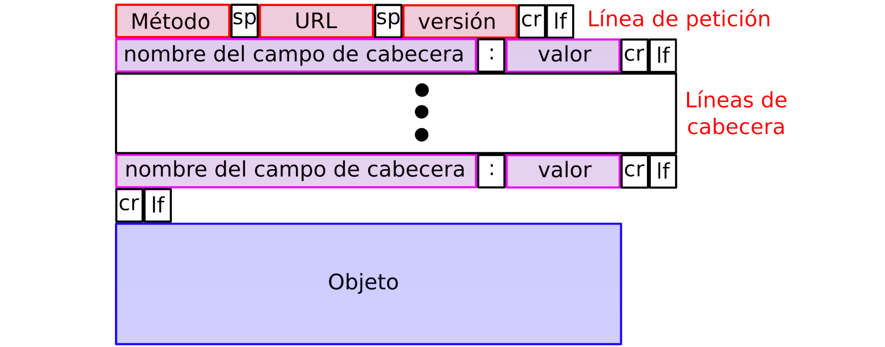

Cada petición consta de una primera **línea de petición**, con el método (GET, POST...), la URI y la versión HTTP usada, varias **líneas de cabecera** que indican el host, el navegador, el idioma, etc, y la **información extra**. Cada una de estas lineas termina en un `\r\n` que indica su final a excepción de la última línea de cabecera, que termina con `\r\n\r\n` para indicar el comienzo de la información extra. Aunque el cliente pida la version HTTP/1.1, es posible que el servidor no sea compatible con esta y le responda con la 1.0, en este caso la conexión seria HTTP/1.0.

La cabecera HTTP incluye la fecha, la longitud del contenido en bytes, el tipo de contenido, etc.

> Descargar y usar Burp Suite, configurando un proxy en el navegador, para ver como funciona exactamente el protocolo, usando un ataque man in the middle.

En el caso de la respuesta HTTP, la primera línea indica simplemente la versión HTTP de la respuesta, el código de respuesta y la frase asociada a dicho código.

##### Métodos HTTP

**GET** es el más usado, puede codificar parámetros en la URL, y su principal desventaja es que es más inseguro que POST, pues los datos son visibles en los logs del servidor web.

**HEAD** devuelve únicamente las cabeceras, lo que permite determinar si el recurso existe, ha sido modificado, etc.

**POST** usado para enviar datos, pues estos se codifican en el cuerpo de la petición.

Además de estos tres métodos implementados en HTTP/1.0, en a versión 1.1 tenemos otros como **PUT**, **OPTIONS** o **DELETE**.

##### Códigos de respuesta HTTP

| Rango completo | Rango definido | Categoria         |
| -------------- | -------------- | ----------------- |
| 100-199        | 100-101        | Información       |
| 200-299        | 200-206        | Éxito             |
| 300-399        | 300-315        | Redirección       |
| 400-499        | 400-415        | Error de cliente  |
| 500-599        | 500-505        | Error de servicio |

De estos códigos los más importante serían:

- *200 OK*: petición exitosa.

- *301 Moved Pernantly*: el objeto buscado ha cambiado de dirección, y se especifica esta nueva dirección en el mensaje.
- *400 Bad Request*: el servidor no puede entender la petición.
- *404 Not Found*: archivo no encontrado.
- *505 HTTP Version Not Supported*.

#### HTTP No persistente y persistente

Se puede implementar HTTP de forma no persistente, donde se envía como mucho un objeto por conexión TCP (es el caso de HTTP/1.0). Tiene la principal desventaja de que para cargar cada elemento de una web se necesita establecer y finalizar una conexión TCP. Se requieren 2RTTs por objeto, y el OS debe trabajar y dedicar recursos para cada conexión TCP.

En el caso de usar HTTP persistente (HTTP/1.1) el servidor deja las conexiones abiertas después de enviar la respuesta, de forma que se utiliza dicha conexión para enviar más mensajes entre cliente y servidor. Esta persistencia se puede llevar a cabo de dos formas:

- **Sin pipelining**: el cliente solo envía un nuevo requerimiento cuando el previo ha sido recibido, y hay un único RTT por cada objeto referenciado.
- **Con pipelining**: el cliente envía los requerimientos tan pronto como encuentre objetos referenciados, de forma que puede llegar a haber incluso un único RTT para todos los objetos referenciados. Es la opción implementada por defecto en HTTP/1.1.

#### Cookies

Se utilizan cookies en las líneas de encabezado de las peticiones y respuestas HTTP. Estas cookies se almacenan en la máquina del usuario y se gestionan en el navegador. Cada cookie tiene asociada una URL, de forma que cuando el navegador accede a una web comprueba las cookies de dicha web.

Para almacenar las cookies en el navegador, la cabecera de respuesta HTTP incluye la línea `Set-Cookie: yummy_cookie=choco`, mientras que para enviarlas al volver a solicitar la página, se incluye la línea `Cookie: yummy_cookie=choco`. En el caso de haber más de una cookie, se separan con `;`.

### Servidores Proxy

#### Web caché

Se implementa un servidor web en la ISP antes de salir a internet, de forma que almacena los datos y acelera el acceso posterior a estos datos. En algunas ocasiones puede incluso hacer peticiones adelantándose al propio cliente.

Para el uso de estas cachés es útil el **GET condicional**, donde en una de las líneas de cabecera se incluye *If-modified-since: < date >* de forma que si el proxy tiene una copia actualizada se recibe el código de respuesta HTTP *304 Not Modified*.

### FTP

Protocolo usado para transferir archivos entre dos sistemas a través de la red, independientemente de su sistema operativo, estructura de ficheros, etc. Basado en texto, usa TCP en el puerto 21. La conexión desde el servidor hacia el cliente utiliza el puerto 22 o el 20. 

Implementa un servicio público usando *anonymous* como user, y un servicio privado usando usuario y contraseña.

El cliente se comunica con el servidor mediante una conexión de control por la que envía comandos que permiten cambiar, crear y borrar directorios, y renombrar y transferir archivos. Para cada transferencia se abre una nueva conexión que se cierra una vez finaliza dicha transferencia.

**Basta con saber diferenciar entre el funcionamiento en modo pasivo y en activo**.

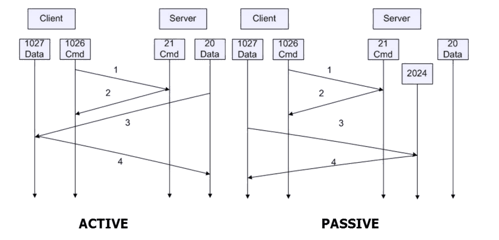

En el modo activo es el servidor el que inicia la conexión de datos después de haber recibido un comando por la conexión de control. Esto puede provocar problemas con el cortafuegos del cliente. Es el modo por defecto.

En el modo pasivo es el cliente el que inicia ambas conexiones tras usar un comando *PASV* para obtener un puerto del servidor para la conexión de datos. Es necesario abrir un rango de puertos en el servidor.


### DNS

Usado principalmente por aplicaciones TCP-IP para obtener la dirección IP a partir del nombre de host. La mayoría de las veces está basado en UDP, solo utiliza TCP cuando se conecta con otro servidor DNS para transferir datos. Utiliza el puerto 53. 

Hay varios niveles de DNS: en el nivel de aplicación, en el SO, y el local, de la red a la que estás conectado.

Los servidores DNS se organizan de forma jerárquica, de forma que hay un servidor para cada uno de los subdominios. Cada nodo tiene asignado una etiqueta, excepto el root. Por ejemplo para traducir *hola.ii.uam.es* hay un servidor que traduce las direcciones *ii*, otro por encima que traduce las *uam*, que a su vez está por debajo del que traduce las *es*, un dominio de primer nivel. *hola* sería el nombre de la máquina.

En el nivel superior se encuentran los dominios genéricos (*gTDL*) como *com, edu, net, org* y los dominios geográficos (*ccTDL*) de dos caracteres (*es, it, uk*). Cada nodo se le asigna a una entidad responsable de su organización y explotación. Además de los servidores primarios, puede haber servidores secundarios con información redundante que permiten ser usados en caso de fallo de los servidores principales.

Cada servidor DNS conoce la IP del servidor superior y de todos los de nivel inferior.

A la hora de resolver un DNS, hay tres tipos de consultas:

- **Recursiva**: el servidor de nombres dará la respuesta completa, es decir, haces una petición al servidor y este hace las peticiones necesarias para devolver la dirección final.
- **Iterativa**: el servidor te indica el siguiente DNS a utilizar para completar la dirección.
- **Inversa**: permite obtener el dominio correspondiente a una IP. Se utilizan consultas iterativas o recursivas con el dominio especial *.IN-ADDR.ARPA*.

En todos los casos, se pregunta en primer lugar al *resolver* dentro del propio PC,  si no se encuentra, se usa el DNS local (si es que lo hay), que nos proporciona, en caso de no estar almacenado el dominio buscado, la lista de servidores raíz. A partir de ahí, vamos buscando el servidor pedido.

Para gestionar dentro de una caché DNS las respuestas almacenadas, cada respuesta tiene un TTL (tiempo de vida) de forma que, si en ese tiempo la respuesta no es utilizada de nuevo, se borra de la tabla.

**No es necesario estudiar la estructura (formato) del protocolo DNS**.

### SMTP

Protocolo que permite enviar correos de cliente a servidor, o entre servidores, usando TCP sobre el puerto 25. Para recepción se emplean POP3 (puerto 110) e IMAP (puerto 143), aunque IMAP es mucho más avanzado que POP3. 

Se emplean distintos comandos ASCII como *HELLO, MAIL FROM, RCPT TO...* para formar el mensaje, que debe estar codificado como texto ASCII de 7-bits y finalizar con `CR/LF.CR/LF`.

#### POP3

Requiere de una autentificación previa. Se pueden bajar los mensajes de dos formas, borrándolos del servidor, de forma que dejan de ser accesibles para cualquier otro cliente, o conservándolos. No mantiene el estado de una sesión a otra.

#### IMAP

Mantiene todos los mensajes en el servidor, permite que el usuario organice los correos en carpetas, visualizar los mensajes de forma remota sin necesidad de descargarlos y mantiene el estado entre sesiones (nombre de carpetas, mapeo de identificadores, etc).

#### MIME

Método para encapsular objetos binarios en US-ASCII. Permite mandar adjuntos en correos electrónicos por ejemplo, pero también se utiliza en HTTP.

### DHCP

Protocolo que permite a un dispositivo obtener una dirección IP dentro de una red, además de conocer la máscara de subred y el router por defecto. Facilita la administración y reduce el número total de direcciones IP, pues permite su reutilización. Su principal inconveniente es que no actualiza la información del DNS.

Las direcciones se pueden asignar de forma *automática* (una dirección permanente para el cliente), *dinámica* (la dirección IP asignada esta limitada a un periodo de tiempo), o *manual* (el cliente configura manualmente la IP).

- El cliente manda un *DHCP discover*, a lo que se le contesta con un *DHCP offer* desde cada servidor de la red, que incluye una posible dirección IP para el cliente. 
- Así, el dispositivo cliente lanza un *DHCP request* con una de las direcciones que le han ofrecido, de forma que el resto de servidores interpretan que su oferta no ha sido aceptada. 
- Por último, el servidor acepta con un *DHCP ACK* confirmando la dirección IP y dos tiempos T1 y T2, de forma que al expirar T1 el cliente debe hacer un nuevo *request* para extender esta IP, a lo que se le responderá con un nuevo *ack* y dos valores T1 y T2 actualizados. 
- Si este *ack* no llega y T2 expira, el cliente manda un nuevo *request*, esta vez a todos los servidores, que pueden o no contestarle. Si ninguno le contesta es necesario iniciar de nuevo el protocolo.

- El cliente puede dejar de usar la configuración IP mediante un mensaje *DHCP release*.

En el caso de que el servidor DHCP no esté en la misma subred que el cliente, se emplea un router de reenvío.

### Resumen puertos

| Protocolo      | Socket  | Puerto |
| -------------- | ------- | ------ |
| HTTP           | TCP     | 80     |
| HTTPS          | TCP     | 443    |
| FTP - Cliente  | TCP     | 22/20  |
| FTP - Servidor | TCP     | 21     |
| DNS            | TCP/UDP | 53     |
| SMTP           | TCP     | 25     |
| POP3           | TCP     | 110    |
| IMAP           | TCP     | 143    |
| DHCP           | UDP     | 67     |


### Redes P2P

En una arquitectura P2P pura, los pares se conectan intermitentemente, sin servidores de por medio, cambiando sus IPs. 

La principal diferencia a la hora de transmitir una archivo entre una arquitectura cliente-servidor y una red P2P es la velocidad. Sea $u_s$ el ancho de banda de subida de un servidor y $u_i, d_i$ los anchos de banda de subida y bajada respectivamente de cada uno de los $N$ nodos, el tiempo que tarda el servidor en distribuir un fichero de tamaño $F$ a todos los clientes es $max(\frac{NF}{u_s}, \frac{F}{min(d_i)})$. Sin embargo, en una red P2P, el nodo que tiene que enviar la copia tardaría $\frac{F}{u_s}$, y el tiempo de subida con eficiencia de distribución absoluta sería $\frac{NF}{u_s+\sum{u_i}}$, por tanto, el tiempo que se tardaría en subir el fichero sería $max(\frac{F}{u_s}, \frac{F}{min(d_i)}, \frac{NF}{u_s+\sum{u_i}})$. Así, al aumentar el N, el tiempo mínimo de distribución crece mucho más despacio en las redes P2P.

#### BitTorrent

**Torrent**: grupo de pares intercambiando fragmentos (chunks) de ficheros.

**Tracker**: rastrea a los participantes en Torrent.

Diferentes pares tienen subcolecciones distintas de fragmentos del mismo fichero. Periódicamente un par le pide a sus vecinos la lista de fragmentos y solicita algunos de los que no tiene (primero los menos reproducidos).

Para enviar fragmentos, un par envía sus fragmentos a los cuatro vecinos que le envían fragmentos a mayor ritmo (este top 4 se evalúa cada 10s). Cada 30s se selecciona aleatoriamente otro par que inicia el envío de fragmentos. De esta forma nos deshacemos de atascos de pares parados.

#### DHT (Distributed Hash Table)

Es la base de datos distribuida de P2P, que contiene pares $\{clave, valor\}$ con clave el identificador de usuario y valor el identificador de contenido, la dirección IP. Los pares consultan la base de datos con la clave y ésta devuelve el valor correspondiente.

#### Primeros esquemas P2P

##### Basados en flooding

La búsqueda utiliza la arquitectura cliente-servidor, pero la transferencia usa P2P. Aunque es muy resistente a la censura y escalable, promociona especialmente el contenido popular, con lo que es difícil encontrar contenido poco popular. Además no hay garantías de calidad de servicio, privacidad, y puede haber envenamiento de datos o tracking.

##### Protocolo Chord

Generamos un **nodeid** y un **keyid** para cada nodo y clave usando el algoritmo SHA1. Cada clave se almacena en el nodo con nodeid igual o mayor que dicha clave. Por ejemplo, la clave K10 se almacenaría en un nodo con ID igual o superior a 10. **Mirar problema 8**.

Se puede demostrar que, usando una tabla de atajos, podemos obtener una eficiencia de $O(nlog(n))$. Para esto, buscamos en nuestra tabla el nodo más cercano a dicha clave que conocemos en nuestra tabla, y saltamos hacia ese directamente, sin recorrer el círculo entero. Estas tablas de atajos están compuestas por dos columnas, por ejemplo, sea $K$ un nodo en una red con $N$ nodos, su tabla constaría de entradas de la forma $\{ K+2^i, sucesor(k + 2^i mod N)\}$ con $i\in  \{0, 1, ..., log_2(N)\}​$.

Cuando un nodo se une a la red, se le transfieren las claves que, por su **nodeid**, le pertenecen. Cuando un nodo abandona la red, transfiere las claves a su sucesor, es decir, al nodo con id siguiente al suyo.

##### Skype

Los nodos utilizan P2P para comunicarse entre ellos, empleando supernodos con dirección IP pública como retransmisor en el caso de que alguno o ambos de los clientes estén en una red local con NAT.


### Ejercicios 

#### Problema 2

Una vez pulsa el botón submit, se envía una petición 

```
POST /actionpage.php HTTP/1.1
Host: http://www.disney.com
\r\n
firstname=nombre&lastname=----
```

#### Problema 4

Las conexiones establecidas serían

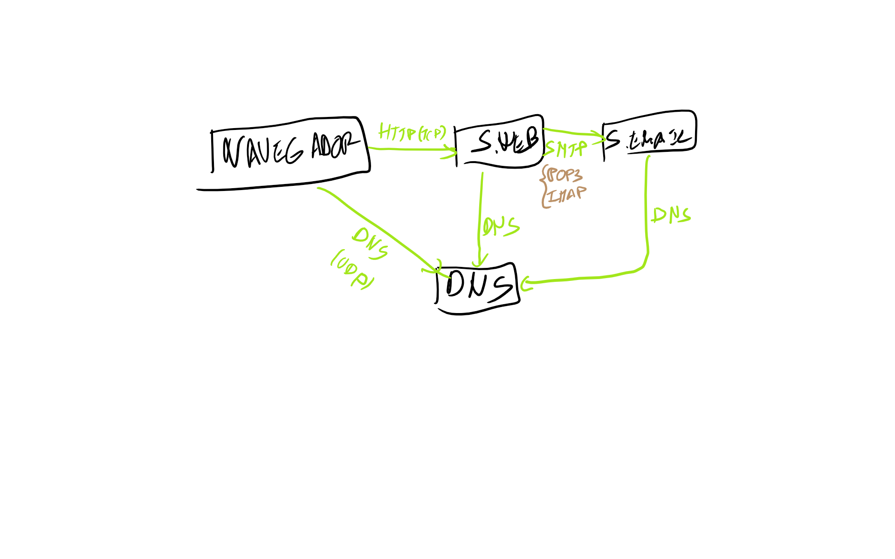

#### Ejemplo examen

> - El DNS local acaba de ser reiniciado. Desde entonces el usuario solo se ha conectado a YouTube.
> - El tiempo de una conexión TCP es $t_c$. Cualquier otro intercambio tarda $t_m$. El DNS local es iterativo. 
> - Se utiliza siempre HTTP/1.1 y como máximo hay dos conexiones simultáneas con el mismo servidor. 
> - Hay que tener en cuenta todas las posibles cachés involucradas.
> 1. El usuario quiere conectarse al FTP. No hay cortafuegos entre ambos. Calcule el tiempo total hasta que se puede usar FTP.
> 2. El usuario se conecta a `forochoces.net`. Calcule el tiempo necesario para conectarse a dicho servidor web.

1. En primer lugar necesitamos obtener la IP del servidor, para lo que usamos DNS. Consultamos al DNS local $t_m$, que solo tiene youtube y es de tipo iterativo, con lo que preguntamos al DNS raíz (otro $t_m$), preguntamos al DNS de TLD .net, y por último al servidor primario. Por tanto, serían $4t_m$ para obtener el DNS y un $t_c$ para conectarse a la web.


#### Problema 5

> Transmitimos un archivo de 10Gbits a 100 nodos que está en un único nodo S con velocidad de subida de 10Mbits. La mitad de los nodos destinatarios tiene una velocidad de subida y bajada de 5Mbps y la otra mitad tiene una velocidad de subida de 0.5Mbps y 2Mbps de bajada. Calcular si tardaría menos con esquema P2P o cliente/servidor.

En el caso de usar una arquitectura cliente servidor, tardaría $10Gbits/10Mbps=10^3s$ en subirse el archivo, por 100 nodos: $10^5s$.

El servidor que más tarda en descargar el archivo es uno de los del segundo grupo, que tienen $2Mbps$ de bajada, con lo que tarda $10Gbits/2Mbps=5*10^3s$. El tiempo que se tarda es por tanto $max(10^5s, 5*10^3s)=10^5s$.

Si usamos una arquitectura P2P, la velocidad total de la red sería $100Mbps + 50*5Mbps + 50*0.5Mbps = 275Mbps$, con lo que el tiempo sería $max(10^5s, 5*10^3s, \frac{100*10^3 Mbits}{275Mbps})=10^5s$.


> #### Problema 8
>
> En sentido horario, pbtenemos Ne1, conectado con N94, que tiene K79 y K08. Este nodo se conecta a N91, que a su vez está conectado a NC1, que contiene K3b. Por último, este nodo NC1 está conectado con Ne1 cerrando el círculo.


## Criptografía y seguridad

La seguridad de la información se sostiene sobre tres pilares básicos:

- **Confidencialidad**: únicamente el receptor puede comprender el contenido del mensaje.
- **Integridad**: asegurar que el mensaje no ha sido alterado.
- **Autenticación**: poder comprobar la identidad del emisor.

### Cifrados cásicos

Hay una serie de cifrados clásicos, inseguros, basados en la sustitución directa de unos caracteres por otros. 

Uno de estos métodos es el cifrado del cesar, donde cada letra de una cadena se modifica tomando la letra *n* posiciones por delante/por detrás del alfabeto. Otro ejemplo sería el cifrado por substitución, que establece una biyección entre las letras del alfabeto. Estos métodos se denominan cifradores de sustitución monoalfabéticos, y son fácilmente atacables mediante análisis de frecuencias.

Un poco más complejos son los cifrados polialfabéticos, entre los que se encuentran el cifrado de Vernam o el de Vinegère, basados en claves almacenadas en soporte físico, lo que los hace muy susceptibles a ataques.

#### Ataques criptográficos

A la hora de intentar desencriptar una información, el ataque puede estar basado en diferentes formas:

- El atacante usa únicamente la fuerza bruta para intentar desencriptar la información.
- El atacante tiene algo de texto legible conocido, lo que facilita el trabajo.
- El atacante se las ingenia para conseguir que transmisor envíe un texto conocido que él verá en su forma encriptada.

### Taxonomía del cifrado

A la hora de cifrar una información, es importante que haya **confusión**, es decir, que se oculten las relaciones entre el texto claro, el texto cifrado, y la clave, y que haya **difusión**, que pequeñas variaciones en la entrada produzcan cambios significativos en la salida (efecto avalancha).

La criptografía se basa en algoritmos conocidos que emplean claves secretas, según estas claves podemos distinguir entre:

- **Criptografía de clave simétrica**: se caracteriza por usar una única clave, corta, y por ser mucho más rápida que la asimétrica. El principal problema es la gestión de dichas claves.

  - De flujos básicos: se encripta un único bit cada vez, aplicando la funcion *XOR* al mensaje y a la clave para obtener el mensaje cifrado. Para descifrarlo, basta con aplicar *XOR* de nuevo.

    - **RC4**: obtenido por ingeniería inversa. Usa claves de 1 a 256 bytes y es rápido, simple y eficiente. Usado por ejemplo en WEP de 802.11, y se puede usar en SSL.

  - De bloques: se divide el mensaje en bloques de igual tamaño y se encripta cada uno como una unidad en un bloque de su mismo tamaño. 

    A la hora de encriptar un bloque, si iteramos una única vez, un cambio de un bit en la entrada solo altera 8 bits de salida, con lo que es necesario iterar varias veces la función, de forma que estos bits afectados se dispersen afectando a otros. Al aumentar el tamaño del bloque es menos eficiente. Para descifrar, basta con invertir el orden de las Ti.

    Un ejemplo de encriptado de un bloque de 64 bits sería:

    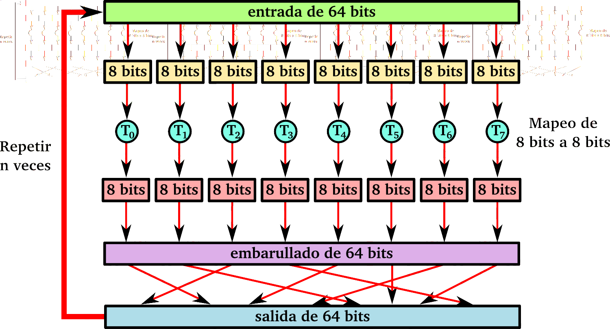

    Hay cuatro modos principales:

    - **ECB (Electronic CodeBook)**: un mensaje es troceado en bloques que se encriptan de forma separada. La desventaja es que códigos iguales producen resultados iguales, por lo que es vulnerable a ataques semánticos.

    - **CBC (Code-Block Chaining)**: antes de ser cifrado cada bloque hace un XOR con el bloque previo ya cifrado. Como no se dispone de un texto cifrado con el que combinar el primer bloque, se usa un vector de inicialización IV que puede hacer único cada mensaje. Este vector no tiene por qué ser privado, pero sí impredecible, no se debe reutilizar y se almacena al comienzo del fichero.

      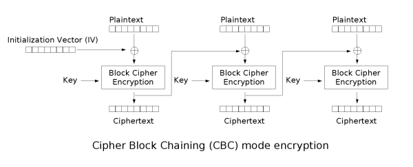

      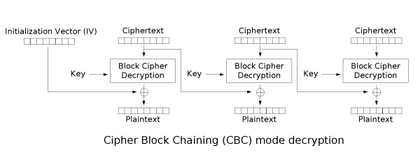

    - **CTR (Counter mode)**: Se usa un cifrado de bloque para producir un flujo pseudo aleatorio conocido como keystream. Este flujo se combina con el texto plano mediante XOR dando lugar al cifrado.
      Para generar el keystream se cifra un contador combinado con un número aleatorio (nonce) mediante ECB y se va incrementando. El valor del contador puede ser públicamente conocido, aunque es preferible guardarlo en secreto. Es necesario que el valor de nonce+contador lo conozcan ambos lados de la comunicación. 

      Para obtener el texto original, basta con volver a aplicar el algoritmo, pues la clave que calcularemos será la misma, y al hacer el XOR con el texto cifrado, obtendremos de nuevo el original.

      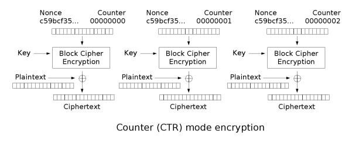

      

    - **PCBC (Propagating Code-Block Chaining)**: variación de CBC diseñada para que pequeños cambios en el texto cifrado produzcan mayores variaciones en la salida.

  - **DES**: Un estándar americano de 1997, basado en claves de 56bits+8 de paridad, usa bloques de 64 bits en cadena. Actualmente es muy inseguro y se puede atacar por fuerza bruta en menos de un día, con lo que se concatenan varias iteraciones (se cifra, descifra y vuelve a cifrar con una clave distinta en cada paso): **3DES**.

  - **AES**: nuevo estandar desde 2001 que reemplaza a DES, basado en álgebra de cuerpos finitos. Emplea bloques de 128 bits con claves de 128, 192 o 256 bits. Es completamente seguro.

- **Criptografía de clave pública**: emplea dos claves, pública y privada, mucho más largas, con lo que el cifrado es considerablemente más lento, sin embargo, la gestión de las claves deja de ser problemática.

  La idea es que la clave privada únicamente es conocida por su propietario, mientras que la pública es conocida por todos. Ambas están vinculadas matemáticamente de forma que lo que se cifra con una solo se puede descifrar con la otra. Se basa en el funcionamiento de la aritmética modular.

  Se suelen usar para obtener una **firma digital** de un fichero, pues son extremadamente lentos para cifrar un arhivo en sí. La fima digital consiste en cifrar con la clave privada el hash (función que produce una salida de longitud fija a partir de un mensaje cualquiera, no invertible) de un mensaje, de forma que el receptor puede usar la clave pública del emisor para obtener dicho hash y volver a aplicar la función hash al mensaje para comparar ambas salidas. Esta firma digital verifica que el emisor y solo el emisor ha podido firmar el mensaje, y que dicho mensaje no ha sido modificado. No es repudiable (es suficiente justificación para determinar el emisor incluso ante un juez).

  También se emplean en **esquemas híbridos**: una vez tenemos la firma digital de un mensaje, encriptamos con una clave simétrica el mensaje junto con su firma digital, y ciframos esta clave simétrica con la clave pública del receptor. De esta forma, el receptor recibe el mensaje cifrado con la clave simétrica, y la clave simétrica que puede descifrar usando su clave privada. Aporta confidencialidad, autenticación e intregidad.

  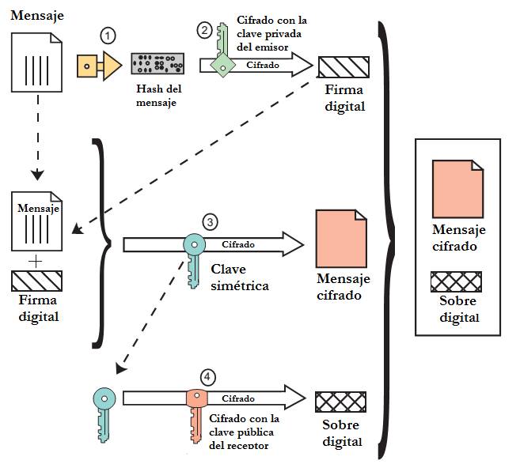

  - **RSA**: intrepretamos un mensaje como un número entero, pues realmente son solo cadenas de bits, con lo que basta con cifrar este número. Las claves se basan en dos primos $p, q$ suficientemente grandes de forma que obtenemos $n = p*q, \enspace z = (p-1)(q-1)$ y buscamos $e<n$ primo relativo con $z$, y $d$ tal que $e*d (mod\enspace z) = 1$ (es fácil encontrar $d$ usando el teorema de Bezout). La clave pública sería entonces $(n, e)$ y la privada $(n, d)​$. 

    Esto nos permite encriptar números $m$ siempre que $m<n$ usando $c=m^e \enspace mod\enspace n$, y para desencriptarlo, $m=c^d \enspace mod\enspace n$. Se puede realizar el procedimiento a la inversa, para obtener una firma digital.

### Integridad de los mensajes

Permite verificar al emisor y al receptor, que los mensajes son auténticos, y según se usen estas técnicas junto con la encriptación, pueden aportar:

- Confidencialidad de los datos: depende únicamente de la encriptación.
- Integridad del mensaje: permite detectar si el mensaje ha sido modificado.
- Autenticación de la fuente: permite determinar si el emisor es el que se supone que es.

#### Message digest

Tenemos **MAC** o **HMAC**, basados en aplicar una función hash criptográfica con una clave simétrica, generando "firmas" simétricas.

Si usamos claves asimétricas, tenemos la firma digital de la que hemos hablado anteriormente. Para evitar problemas y poder asegurar que nuestro par de claves pública y privada son realmente nuestros, utilizamos una **Autoridad Certificadora (CA)**, que asocia nuestra clave pública con un ente confiable. Para esto, enviamos nuestra clave pública a la entidad, que nos devuelve un certificado que contiene identificación de la entidad y nuestra clave cifrada con su clave privada, de forma que cualquier persona puede estar segura de que ha sido dicha CA quien ha emitido el certificado.

El principal estándar usado es el *X.509*, donde el certificado contiene el nombre de quien lo emite, de la entidad, clave pública de la entidad, y la clave pública de quien solicita el certificado, entre otras cosas. Finalmente, se concatena al final del fichero un hash de esta información firmado con la clave privada de la CA. Es necesario una **Public-Key Infrastructure (PKI)** para gestionar todos los certificados.

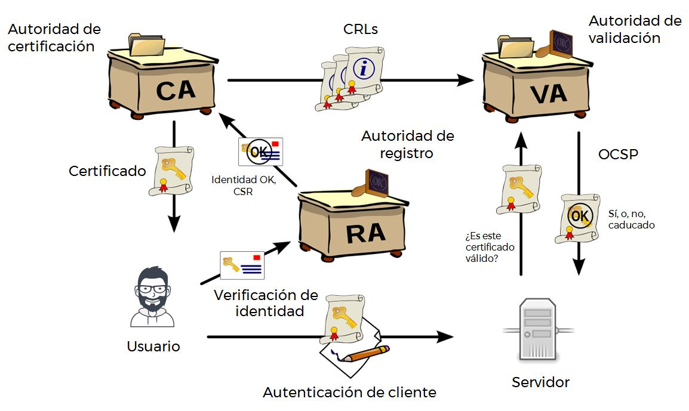

#### Autenticidad de extremo

Una vez que podemos asegurar mediante la firma digital quién originó un mensaje, ¿como podemos asegurarnos de que fue esta persona la que lo envió?

Para un ataque de reproducción (enviamos el mismo mensaje múltiples veces), por ejemplo, usamos un valor único que incluimos en la firma, de forma que el receptor de asegura de que este número sea único cada vez.

### Autenticación

Para autenticarnos en un servicio, lo ideal es usar tres métodos distintos, donde cada uno se le añade al anterior:

- Algo que sabemos: contraseñas, PINs, claves criptográficas, etc.

  La implementación es muy simple, pero son muy vulnerables a ataques, sobretodo si son compartidas. Lo ideal sería que las contraseñas expirasen cada *x* tiempo y con *n* fallos consecutivos.

- Algo que tenemos: DNIe, teléfonos móviles, tarjetas de coordenadas, etc. 

  Es más incómodo para el usuario, y la implementación es mas compleja, además puede perderse el token o dispositivo.

- Algo que somos: firma manuscrita, huellas dactilares, voz, retina, etc.

  De nuevo, es incómodo para muchos usuarios, solo es funcional para personas, y además, normalmente no suelen estar bien diseñados, con lo que hay potenciales problemas de seguridad y de robo de plantillas biométricas.

  #### Ataques a contraseñas

  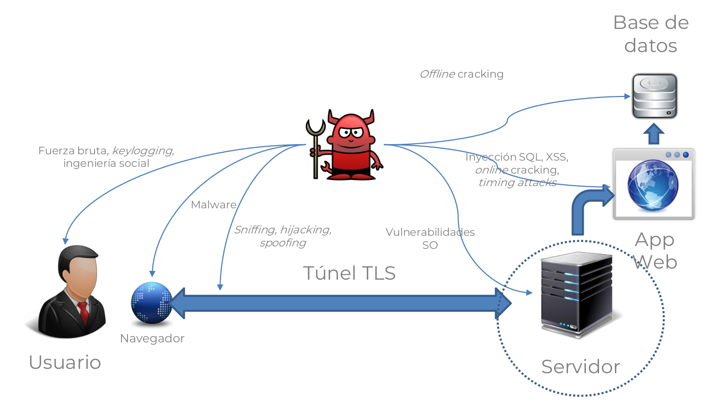

Los ataques para otener contraseñas pueden ser distintas formas:

- Destinados al servidor, a su sistema operativo, provocando un buffer o head overflow, reconociendo errores de configuración, etc, o bien a los servicios y aplicaciones usados por dicho servidor, inyectando código SQL, LPAD, comandos, o ataques a las APIs.

- Ataques a la red, contra la comunicación cliente-servidor, lo que permitiría obtener tokens de usuario (sniffing), modificar la comunicación (por ejemplo, ARP. Spoofing, MITM) y suplantar la identidad del usuario (Hijacking, Spooking).

- Destinados al usuario, usando ingeniería social como ataques de phising, *digital trashing* (buscar información útil sobre el atacado, como post-its en su despacho, datos en Facebook, etc), o *shoulder surfing*, emplear cámaras para grabar las pulsaciones el pin, por ejemplo.

  **Cracking de contraseñas**: por lo general, los seres humanos elegimos muy mal las contraseñas, lo que permite reducir mucho el espacio de búsqueda, utilizando contraseñas candidatos, diccionarios de contraseñas, con o sin reglas, y fuerza bruta con o sin reglas.

  Si es cracking online, puede ser más complicado por tener un número máximo de intentos y porque el servidor percibe dicho ataque, con lo que puede activar por ejemplo un CAPTCHA. Otra opción es realizar un ataque inverso, de forma que fijamos una contraseña y variamos el usuario. Una herramienta para estos ataques es **Hydra**.

  Puede realizarse este cracking offline, sobre bases de datos de usuarios filtradas. Las contraseñas en bases de datos nunca deberían guardarse en claro, como mínimo, se debe guardar hasheadas con *SHA256* en adelante. Sin embargo, una vez tenemos la base de datos, podemos comparar distintas contraseñas, aplicando la función hash, con la almacenada, hasta dar con la correcta. Esto se puede hacer por fuerza bruta, mediante diccionarios, o mediante *tablas rainbow*, que precalculan los hash de todas las posibles combinaciones de hasta *n* caracteres.

  Para dificultar todos estos tipos de ataques, lo ideal es añadir un *salt* aleatorio a la contraseña antes de aplicar la función hash. De esta forma, almacenamos el resultado de la función hash junto con el salt generado, con lo que la entrada de la función hash es mucho más larga, y por tanto más difícil de adivinar. Para comprobar la contraseña, basta con concatenar salt y contraseña, obtener el hash y comparar con el almacenado.

  Además, para aumentar aún más la seguridad, es preferible hacer uso de funciones de derivación de claves como *PBKDF2*, *scrypt* o *bcrypt* en vez de simples funciones hash, y almacenar el salt, hash, y numero de iteraciones de la función. Estas funciones se basan en iterar sobre las funciones de hash, mínimo unas 10.000 veces, ocupando una gran cantidad de menoria RAM, de forma que son mucho más lentas y dificultan los ataques por fuerza bruta.


### Seguridad en las conexiones TCP (SSL)

SSL, Secure Sockets Layer, es un protocolo de nivel de transporte desarrollado por Netscape en 1993 con multitud de problemas y vulnerabilidades. Su sucesor es **TLS** (Transport Layer Security).

Al poderse aplicar a cualquier conexión TCP, es ampliamiente usado para proteger protocolos como FTP, SMTP, IMAP o HTTP. Provee confidencialidad, integridad y autenticación.

A la hora de cifrar la información, SSL admite diversos mecanismos, tanto simétricos (DES, 3DES, RC2, RC4) como de clave pública (RSA), de forma que el cliente ofrece las opciones, y el servidor elige una de ellas. Así, en un **handshaking**, el cliente envía la lista de algoritmos que soporta, junto con número de unicidad del cliente. El servidor elige un algoritmo de la lista y envía dicha elección junto con un certificado *X.509* que incluye su clave pública, y su número de unicidad. El cliente comprueba el certificado recibido y comprueba si la CA es o no conocida (si no es conocida, permite al usuario agregarla bajo su responsabilidad), genera el *pre-master secret* , lo encripta con la clave pública del servidor y se lo envía. Entonces, utilizando este *pre-master secret* y los números de unicidad, ambos calculan independientemente las claves MAC, las claves de encriptación y los vectores de inicialización, y envían al otro un MAC de todos los mensajes del handshake. De esta forma, evitamos ataques man in the middle.

Es buena idea que el servidor envíe números de unicidad aleatorios, de forma que las claves son distintas en cada conexión, y evitamos que un intruso pueda observar los mensajes y reenviarlos de nuevo.

#### SSH

El nivel de transporte se encarga de:

- La autenticación del servidor.
- Establecimiento de un canal cifrado para garantizar la confidencialidad de la comunicación.
- Comprobación de la integridad de los mensajes.
- Generación de identificador único de sesión.

A la hora de autenticar al usuario, el protocolo permite la autenticación mediante criptografía de clave pública, donde el usuario dispone de un par de claves pública y privada, autenticación basada en nombre de usuario y contraseña (que se envía cifrada), o basada en la direccion IP origen de la conexión (no es segura, no debería usarse en entornos empresariales).

El establecimiento de sesión se encarga de la asignación de identificadores de sesión, que permiten multiplexar varias comunicaciones distintas a través de un único “túnel” de cifrado virtual.

#### NAT

Se encarga de ocultar el direccionamiento IP interno de una red.

#### VPN (Virtual Private Network)

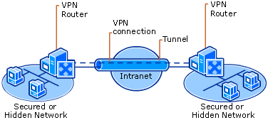


Tecnología que permite que el ordenador en la red envíe y reciba datos sobre redes compartidas o públicas, como puede ser internet, como si fuera una red privada con toda la funcionalidad, seguridad y políticas de gestión de una red privada. Se puede implementar mediante distintos protocolos:

- **PPTP (Point-to-Point Tunneling Protocol)**: funciona a nivel de enlace y está pensado para conexiones sencillas entre cliente y servidor. No permite conectar dos redes.
- **L2TP (Layer 2 Tunneling Protocol)**: una combinación de PPTP con el antiguo L2F.
- **IPSec**: Es el estándar más completo, pues permite todo tipo de conexiones, incluyendo túneles que conectan dos redes completas, en lugar de dos ordenadores. Como inconveniente tiene que puede llegar a ser difícil de configurar.

### Seguridad en redes LAN

#### WEP (Wired Equivalent Privacy)

Emplea cifrado de clave simétrica basado en RC4, de forma que cada paquete es cifrado por separado, y podemos desencriptar un paquete incluso cuando el anterior se ha perdido. Es muy eficiente pues puede ser implementado por software o por hardware.

Para encriptar los datos, el transmisor calcula un Valor de Chequeo de Integridad (ICV) de los datos, de 4 bytes. Cada extremo tiene una clave compartida de 104 bits, a la que el transmisor añade 24 bits de un vector de inicialización, obteniendo una nueva clave, además de un ID de clave de 8 bits. A partir de esta nueva clave generamos el keystream. Se envían el vector de inicialización y el ID, junto con los datos e ICV encriptados. De esta forma, el receptor extrae el IV el ID de clave, y junto con la clave compartida de 104 bits genera el keystream y desencripta los datos, que luego verifica con el ICV.

Sin embargo, como el vector es de 24 bits, acaba reutilizándose, y al no estar cifrado es posible detectar esta reutilización. Si un intruso consigue que el emisor cifre texto conocido, puede ver el texto codificado y obtener así la clave, de forma que podrá decodificar el resto de mensajes. Actualmente hay mejores opciones como **WPA** y **WPA2**.

### Seguridad operacional

#### Cortafuegos

Permite aislar una red de internet, bloqueando paquetes indeseados. Así, previene ataques de denegación de servicio, la modificación o el acceso ilegal a datos internos, y limita los accesos al interior de la red. Pueden ser de tres tipos:

- Filtros de paquete sin estado: la red se conecta a internet a través de un router cortafuegos que filtra paquete por paquete basándose en las IPs origen o destino, los puertos, el tipo de mensaje ICMP o en los bits SYN o ACK de TCP. En este caso, no hacemos comprobaciones sobre los paquetes, es decir, podemos aceptar un un paquete con ACK activo aunque no exista ninguna conexión TCP.
- Filtrado de paquetes con estado: tiene en cuenta el estado de la conexión TCP para determinar si los paquetes tienen o no sentido, y puede hacer timeout de conexiones inactivas bloqueándolas.
- Gateway de aplicación: filtra los paquetes según los datos de aplicación o campos IP/TCP/UDP. Así, podemos permitir el acceso a un servicio solo a usuarios seleccionados.

#### IDS (Intrussion Detection Systems)

Al contrario que los cortafuegos, los IDS revisan detenidamente el contenido de cada paquete buscando posibles virus, ataques, etc. Además, examina la correlación entre múltiples paquetes distintos para prevenir escaneo de puertos, ataques DoS o mapeos de la red.


## Multimedia networking

Denominamos aplicaciones multimedia a aquellas que envían audio o vídeo por la red de forma continua. Se caracterizan por requerir una calidad de servicio (*Quality of Service*) bastante alta, es decir, la red tiene que tener un rendimiento suficiente par el correcto funcionamiento de la aplicacion.

Estas aplicaciones pueden ser multimedia a partir de elementos almacenados, en vivo, o interactivo en tiempo real. Todas ellas son sensibles a los retrasos, tanto terminal a terminal como a las variaciones (*jitter*), sin embargo, son tolerantes a pequeñas pérdidas de paquetes.

##### Multimedia almacenado

Se transmite un paquete almacenado en el servidor a un cliente, de forma que el cliente reproduce el flujo recibido mientras se recibe el resto. Este cliente puede pausar, adelantar, rebobinar, etc.
Unos 10s de retraso para inciar la reproducción y 1 o 2 para los comandos son aceptables.

##### Multimedia en vivo

Son por ejemplo programas de radio o eventos deportivos en directo.
Es necesario un bufer de reproducción donde se acumule parte del contenido antes de empezar la reproducción, y las conexiones pueden tener pérdidas de algunos segundos. Se debería poder pausar y rebobinar.

##### Multimedia en tiempo real

Aplicaciones como telefonía IP, videoconferencias, juegos online, etc.
Son necesarios retrasos terminal a terminal muy pequeños, por ejemplo unos 150ms para audio, aunque menos de 400ms son aceptables.
Normalmente se utiliza un servidor de inicialización para conocer los datos del receptor (IP, puerto etc).

### Multimedia en internet

Para implementar todas estas necesidades, consiguiendo la mayor calidad de servicio y eficiencia posibles, se suelen utilizar implementaciones con basadas en UDP, con técnicas a nivel de aplicación para mitigar las pérdidas y los retrasos.

##### Evolución de Internet para el soporte multimedia

Hay varias opciones:

- **Filosofía de servicios integrados**: cambios en la estructura de internet para que las aplicaciones puedan reservar un ancho de banda entre terminales, lo que requeriría de un complejo software en ordenadores y routers.
- **Filosofía de servicios diferenciados**: requiere pequeños cambios en la infraestructura. Se usan bits de la cabecera IP para determinar el tipo de tráfico que constituye y darle más o menos importancia.
- **Dejarlo estar**: No se realiza ningún cambio importante, simplemente se aumenta el ancho de banda cuando sea necesario.

#### Compresión

En el caso del audio, se realiza un muestreo analógico de frecuencia fija (unas 8000 muestras por segundo en telefonía o 44100 en un CD de música). Estas muestras son digitalizadas y enviadas por la red, de forma que el receptor tiene que convertir de nuevo la señal digital a analógica, con la consiguiente pérdida de calidad.

Para el vídeo, se establece una frecuencia fija de imágenes, por ejemplo de 24 imágenes por segundo. Hay distintos formatos como MPEG1 (CD-ROM), MPEG2 (DVD) o MPEG4 (suele usarse en internet).

### Streaming de audio y vídeo almacenados

Una aproximación simple sería utilizar HTTP para el envío de ficheros como objetos, de forma que la reproducción empieza cuando el cliente ha recibido el archivo entero. Esto implica grandes retrasos hasta la reproducción.

Una opción ligeramente más sofisticada sería utilizar el navegador y HTTP para obtener a partir del servidor un *metafichero*, que el navegador envía al reproductor. De esta forma, el reproductor contacta con el servidor, que envía el flujo de audio o vídeo usando HTTP.

Por último, tenemos el streaming desde un servidor, donde el navegador obtiene el metafichero a través de HTTP, envía dicho fichero al reproductor de media, que se conecta directamente a un servidor de flujo por TCP o UDP, pero evitando así HTTP.

#### UDP o TCP

En el caso de usar UDP, si no hay congestión en la red, el servidor puede enviar a la velocidad apropiada para el cliente, de forma que la velocidad de envío es la velocidad de decodificación, y es constante, la velocidad de llenado sería la velocidad de envío menos la pérdida de paquetes.
Basta con un retraso de reproducción de 2 a 5 segundos para evitar el jitter de la red.

Si se usa TCP, el envío se realiza a la velocidad máxima admisible por TCP, y el llenado del buffer fluctua debido al control de congestión de TCP, lo que produce un mayor retraso de reproducción. Sin embargo, tiene la ventaja de que HTTP/TCP pasan de forma más sencilla por firewalls.

#### RTSP
Es un protocolo a nivel de aplicación cliente-servidor que permite rebobinar, reposicionar, pausar, avanzar rápido, etc. Sin embargo, no define ningún tipo de encapsulación de audio o vídeo, ni determina el nivel de transporte o el comportamiento de buffer.
Los mensajes de control RTSP se envían *fuera de banda*, es decir, utilizan otra conexión distinta al flujo de datos, que corre sobre el puerto 554.
Se considera que el flujo multimedia está *en banda*.

### Telefonía en internet

El usuario emisor alterna periodos de habla con periodos de silencio, de forma que se envían paquetes generados únicamente mediante el habla, de 20 milisegundos a 64kbps, es decir, 160 bytes de datos. La aplicación agrega una cabecera a cada segmento, de forma que el conjunto se encapsula en un datagrama UDP y se envía por la red.
Para el correcto funcionamiento de estos servicios, es necesario tener en cuentas pérdidas en la red debidas a la congestión y la pérdidas por retardo, en las que el datagrama llega demasiado tarde como para ser reproducido (el retraso máximo tolerable suele ser 400ms). Normalmente se puede tolerar entre 1% y 10% de paquetes perdidos. El jitter debe ser inferior a 20ms.

#### Retraso de reproducción fijo

El receptor intenta reproducir cada segmento exactamente *q* ms después de que fuese generado, de forma que a mayor *q*, menor es la pérdida de paquetes, pero peor la experiencia interactiva.

#### Retraso de reproducción adaptativo

Se pretende minimizar el retardo de reproducción y la pérdida de paquetes por retardo. Para esto, se ajusta el retardo de reproducción a una estimación del retardo de la red al comienzo de cada segmento de habla y se alargan o comprimen los periodos de silencio.

Sean:

- $t_i​$: marca de tiempo del i-ésimo paquete.
- $r_i$: tiempo de recepción del i-ésimo paquete.
- $p_i$: tiempo en el que comienza la reprodución el i-ésimo paquete.
- $r_i - t_i$: retardo de red para el i-ésimo paquete.
- $d_i$: retardo promedio estimado después de reproducir el i-ésimo paquete. Lo que tarda el paquete desde que se envía hasta que se empieza a reproducir.

$d_i = (1-u)d_{i-1} + u(r_i-t_i)$ donde $u$ es una constante fija, por ejemplo $u = 0.01s$.

También es útil estimar el promedio de las variaciones de retardo $v_i = (1-u)v_{i-1} + u|r_i-t_i-d_i|$. En el primer paquete, es cero, por no haber retardo anterior con el que comparar.

Estos estimadores son calculados para cada paquete recibido, aunque se usan únicamente al inicio de cada segmento de habla.

El primer paquete de un segmento de habla se reproduce en tiempo $p_i=t_i+d_i+Kv_i$ con $K$ una cte positiva. Los paquetes restantes del segmento se reproducen periódicamente.

Para identificar cuando comienza un nuevo segmento de habla, el receptor comprueba diferencias de más de 20 ms en las marcas de tiempo si no hay pérdidas, o si hay pérdidas, diferencias de más de 20 ms y números de secuencia sin espacios. De esta forma, identificamos silencios.

#### Recuperación de pérdidas

##### Forward Error Correction (FEC)

La opción más simple es: por cada n paquetes se añade uno redundante de paridad, de forma que permite recuperar un paquete en caso de pérdida, a costa de aumentar el ancho de banda en factor 1/n y el retardo de reproducción.

Otra opción es agregar, con cada paquete, una versión redundante de menor calidad del anterior (por ejemplo a 13kbps), de forma que si no hay pérdidas consecutivas, se puede subsanar la pérdida de un paquete.

La tercera opción consiste en subdividir las tramas en unidades más pequeñas, de 4 o 5 ms por ejemplo, y entrelazarlas entre ellas. De esta forma, si se pierde un paquete, solo perdemos pequeños fragmentos de cada trama.

### Protocolos para aplicaciones interactivas en tiempo real

#### Real Time Protocol (RTP)

Protocolo que especifica una estructura de un paquete para transportar audio y vídeo, y otros medios. Cada paquete contiene una identificación del tipo de carga, un número de secuencia, un timestamp y un identificador de la fuente del flujo (SSRC) que permite identificar la fuente independientemente de la dirección de red. RTP corre en los sistemas extremos (es decir, los routers no saben nada acerca del protocolo, no provee QoS) y sus paquetes se encapsulan en datagramas UDP. Permite interoperabildad entre distintas aplicaciones.

#### Real Time Control Protocol (RTCP)

Trabaja junto con RTP de forma que cada participante en una conexión RTP transmite periódicamente paquetes de control RTCP al resto de participantes. Reporta estadísticas como el número de paquetes enviados y perdidos, el jitter, etc, que pueden ser usadas para controlar la calidad del flujo por ejemplo.

Normalmente en una sesión RTP hay una única dirección multicast, y todos los paquetes RTP y RTCP de dicha sesión usan esa dirección. Los paquetes de ambos protocolos se distinguen entre sí por el número de puerto usado. A medida que aumentan los participantes, cada uno de ellos disminuye su tráfico RTCP. Hay tres tipos de paquetes:

- Los receptores envían información sobre la fracción de paquetes perdidos, el último número de secuencia, el promedio del jitter, etc.
- Los transmisores envían el SSRC del flujo RTP, el tiempo actual y el número de paquetes y bytes enviados.
- Paquetes descripción de fuente: proporcionan un mapeo entre el SSRC y su nombre de usuario y host. Informan de la dirección email del transmisor, su nombre y el SSRC asociado al flujo RTP.

##### Sincronización de flujos

RTCP permite sincronizar diferentes flujos dentro de una misma sesión RTP. Por ejemplo, para una videollamada, los paquetes RTP contienen el timestamp de los relojes de muestreo de vídeo y audio, no el del reloj de tiempo real. Así, cada paquete RTCP de reporte del transmisor incluye la marca de tiempo del paquete RTP más reciente y el tiempo real del instante en el que fue creado, lo que permite a los receptores sincronizar vídeo y audio.

##### Escalamiento de ancho de banda

RTCP intenta limitar su tráfico al 5% del ancho de banda, de forma que dada una transmisión RTP, RTCP se limitará al 5% del ancho de banda de esta transmisión, dividiendo el 75% de la tasa a receptores, y el 25% a transmisores. De esta forma, cada participante calcula el tiempo entre mensajes RTCP a partir de su tasa y del tamaño medio de los paquetes RTCP.

### Redes de distribución de contenidos (CDN)

A la hora de distribuir grandes archivos por todo el mundo, se utilizan redes de distribución de contenidos de forma que los archivos se replican en cientos de servidores con el objetivo de estar más cerca del usuario final, para así evitar retrasos, pérdidas, etc. Cuando se actualiza el contenido, CDN actualiza los servidores.

Para que esto funcione, el CDN crea un *mapa* indicando las distancias desde ISPs hojas (proveedor de servicios de internet) y nodos CDN. Cuando llega una consulta al servidor DNS, este determina el ISP desde el cual se realiza la consulta y se usa el mapa para elegir el mejor servidor CDN.

### Garantías de calidad de servicio (QoS)

Actualmente usamos *best effort* para tener la mejor calidad de servicio posible, en la próxima generación de internet, se usarán métodos de QoS como **RSVP**, un protocolo de señalización para reservar recursos como ancho de banda, además de servicios integrados, con QoS garantizado, o servicios diferenciados.

Hay distintos principios para garantizar la calidad de servicio:

- Es necesario marcar los paquetes de forma que el router pueda distinguir entre distintas clases y definir una nueva política en el router para actuar en consecuencia.

- Es necesario aislar unas clases de las otras. Así, por ejemplo, impedimos a una aplicación usar más ancho de banda del declarado.
- Buscamos conseguir, mientras conservamos el aislamiento, la mayor eficiencia en el uso de recursos. Si asignamos un ancho de banda fijo y no se usa todo lo asignado, es ineficiente.
- Una vez el flujo declara su necesidad, la red tiene que poder bloquearlo si no se pueden satisfacer los requerimientos.

### Mecanismos de itineración

Itineración: elección del próximo paquete a enviar.

- **FIFO**: enviamos en orden de llegada a la cola. En caso de estar llena, podemos descartar el paquete que acaba de llegar, el que tenga menor prioridad o uno aleatorio.
- **Colas de prioridad**: tenemos distintas clases con prioridades diferentes, y enviamos el paquete encolado de mayor prioridad.
- **Round Robin**: barre cíclicamente las colas de cada clase, sirviendo uno de cada una (si lo hay).
- **Weighted Fair Queuing (WFQ)**: un Round Robin generalizado en el que cada clase obtiene una cantidad ponderada de servicio en cada ciclo.

##### Mecanismos de políticas

A la hora de limitar el tráfico, podemos establecer distintos parámetros:

- **Tasa promedio**: cuántos paquetes pueden ser enviados por unidad de tiempo. Sin embargo, no es lo mismo indicar 100 paquetes/s que 6000/min.
- **Tasa peak**: para evitar abusos, como por ejemplo, lanzar los 6000/min en un segundo, se establece una tasa pico, por ejemplo 1500 pps (paquetes/s).
- **Tamaño de ráfaga** (Burst size): máximo número de paquetes enviados consecutivamente.

Para aplicar estas tasas usamos un **Token bucket**, que limita la entrada a un tamaño de ráfaga y una tasa promedio. Consideramos un cubo donde caben $b$ fichas, que se generan a una tasa de $r \enspace fichas/s$ mientras el cubo no esté lleno, y por cada ficha que salga del cubo sale un paquete a la red. Entonces, en un intervalo de tiempo $t$, el número de paquetes admitidos es $\leq rt+b$. 

Este token bucket junto con WFQ permiten proveer un límite superior, garantizando retardo, es decir, garantía de QoS.

### Servicios integrados y garantizados

Buscamos una arquitectura que permita proveer garantías de QoS en redes IP para sesiones de aplicaciones individuales. Para esto, buscamos reservar recursos en los routers, que han de mantener información sobre su asignación, y admitir o denegar el establecimiento de nuevas llamadas, comprobando si se puede admitir un nuevo flujo sin violar las garantías de QoS hechas a los ya admitidos.

##### Servicios integrados (Intserv)

Para reservar recursos en la red, es necesario un protocolo de establecimiento de llamadas, señalización, etc, para lo que usamos RSVP. 

Una sesión necesita declarar entonces sus requerimientos de QoS (R-spec), caracterizar el tráfico que enviará por la red (T-spec) y usar el protocolo RSVP para propagar los datos anteriores a los routers donde se requiere la reserva.

Hay dos modelos de servicio:

- Servicio garantizado: tiene un retardo acortado simple. El peor caso es cuando la fuente tiene política **leaky-bucket**.
- Servicio de carga controlada: permite una QoS próxima a la que el mismo flujo recibiría de un elemento de red no cargado.

El principal problema de los servicios integrados es la escalabilidad, mantener el estado de flujo en el router es difícil con un gran número de flujos. Además, aunque tiene un pequeño número de clases predefinidas, nos gustaría poder tener servicios relativos como Platinum, Gold, etc.

##### Servicios diferenciados (Diffserv)

Se basa en el uso funciones simples en la red interna y funciones relativamente complejas en los hosts. No define clases de servicio, pero provee componentes funcionales para construirlas.

Definimos perfil como una tasa pre-negociada A, con un tamaño del balde B.

Los routers del borde se encargan de marcar el tráfico según el flujo (marcas basadas en clases) y como dentro o fuera de perfil (marcas intra-clases), mientras que los routers  de la red administran el tráfico en distintos buffers y dan preferencia según las marcas hechas en los bordes.

En la actualidad, esto se implementa en el campo Type Of Service en IPv4 o en Traffic Class en IPv6. Se usan 6 bits para Differentiated Service Code Point (**DSCP**), que determina el comportamiento por salto que recibirá (**PHB**, Per-Hop Behavior).

El tráfico es medido continuamente, y "moldeado" si no cumple el perfil.

Actualmente hay dos PHB definidos:

- Expedited Forwarding: se garantiza a una clase de tráfico que recibirá un ancho de banda mayor o igual que el especificado. Proporciona un ancho de banda mínimo garantizado.
- Assured Forwarding: cuatro clases de tráfico, cada uno con una cantidad de ancho de banda mínima garantizada. Dentro de cada clase, los paquetes vuelven a clasificarse en tres particiones de preferencia de descarte predefinidas. Si hay congestión en una clase, el router descarta basándose en esta preferencia.

### RSVP

Un protocolo de establecimiento de llamada. Se encarga de la señalización para reservar recursos a lo largo del camino extremo a extremo,  por ejemplo, el ancho de banda.

El objetivo es permitir acomodar diferentes anchos de banda a lo largo del camino, aplicaciones con diferentes requerimientos de recursos, hacer que multicast sea un servicio de primera clase, adaptándose a los miembros, impulsar el enrutamiento multicast/unicast existente, y controlar el overhead de protocolo. Pretende conseguir un diseño modular para tecnologías subyacentes, sin especificar cómo se deben reservar los recursos, qué rutas deben seguir los paquetes, y sin interactuar con el reenvío de paquetes.


**FALTA EL PROTOCOLO SIP Y MÁS IMFORMACIÓN SOBRE RSVP**